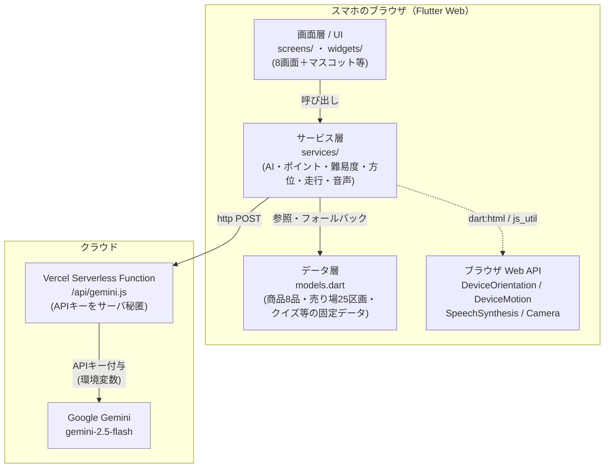
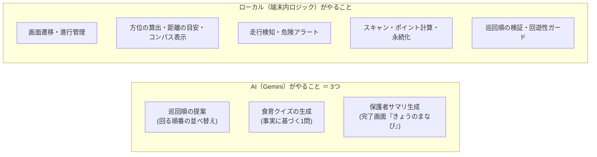

# 00. 概要と全体アーキテクチャ

スライドの「導入」「全体構成」パートで使う。**何を・どんな技術で・どう組んだか**を1枚絵で示す。

---

## 1. プロダクト概要（30秒）

- **鳩ナビ（はとナビ）おつかいクエスト** — スーパーでの親子の買い物を「知育エンタメ」に変える **Flutter Web** アプリ。
- 子どもが売り場を巡り、商品をスキャンして食育クイズに答え、**ポイント・限定バッジ・シール**を集める。完了後は**AIが保護者向けに「きょうのまなび」をまとめる**。
- ハッカソン背景: **平和堂 × ソフトバンク × 龍谷大学**。
- 公開: `https://hatonavi.vercel.app`（Vercel）。スマホの Chrome / Safari で動作（カメラ・センサー許可）。

### 三方よし（誰の何を解決するか）
| 対象 | 課題 | 解決 |
|---|---|---|
| 親 | 買い物中に子がぐずる／走り回る／動画頼りの罪悪感 | 能動的な「お手伝いの冒険」に変える・時短 |
| 子 | 買い物に関われず退屈 | 学び・達成感（クイズ・バッジ・シール） |
| 店（平和堂） | 次世代ファミリー層の獲得・ファン化 | 来店動機・ロイヤリティ |

---

## 2. 技術スタック

| レイヤー | 採用技術 |
|---|---|
| フロント | **Flutter Web**（Dart SDK ^3.12.2、Material 3） |
| 状態管理 | 標準の `StatefulWidget` + `setState`（外部ライブラリなし） |
| 永続化 | `shared_preferences`（端末ローカル KV） |
| カメラ/スキャン | `mobile_scanner` ^7.0.0 |
| センサー/音声 | ブラウザ Web API を `dart:html` / `dart:js_util` で直接利用（DeviceOrientation / DeviceMotion / SpeechSynthesis）。**専用パッケージは未使用** |
| AI | **Google Gemini（gemini-2.5-flash）** を Vercel Serverless Function 経由で利用 |
| バックエンド | Vercel Serverless Function（`api/gemini.js`、Node） |
| ホスティング/CI | Vercel（`main` push で自動ビルド＆デプロイ） |
| 通信 | `http` ^1.2.2（同一オリジン `/api/gemini` への POST） |

---

## 3. レイヤー構成図（アーキテクチャ）



**ポイント（説明の勘所）**
- **画面 → サービス → データ/外部** の素直な単方向依存。画面はサービスを呼ぶだけ。
- **AI は必ず Vercel Function を経由**。`GEMINI_API_KEY` をフロントに出さず、サーバ側環境変数で秘匿。
- センサー・音声・カメラは**端末（ブラウザ）側**で完結。位置情報やカメラ映像をサーバへ送らない（プライバシー配慮）。

---

## 4. 役割分担：AI / ローカル（★誤解されやすい点）

「AIが何をして、何をしていないか」を明確に。



> ❌ AIに「現在地推定・通路ルート生成・方角計算・危険判定・スキャン・精算」はさせない。
> ❌ ナビ中に Gemini を毎回呼ばない（呼ぶのは開始時の巡回順・商品ごとのクイズ・完了時の保護者サマリだけ）。
> ✅ AIの3用途はいずれも**事実グラウンディング＋失敗時フォールバック**で守られる「検証・やり直しがきく仕事」。危険なこと（方角・安全・進行・お金）はローカルが確実に行う。

---

## 5. 設計を貫く2大思想

### (A) 「デモが必ず最後まで動く」フォールバック設計
外部要因（AI・ネット・センサー・OS）が失敗しても、体験が途切れない。

| 失敗ポイント | フォールバック |
|---|---|
| Gemini クイズ生成が失敗/不正 | 手書きの固定クイズ（`models.dart`） |
| Gemini 巡回順が不正/失敗 | ローカルの一方向スイープ順（`pathIndex` 昇順） |
| Gemini 保護者サマリが失敗/空 | 固定のまとめ文（`sticker_screen.dart`） |
| 方位センサー非対応 | 北固定（0度）を1回流す |
| 加速度センサー非対応 | 走行ロックを出さず通常進行 |
| 音声非対応ブラウザ | 無音で続行 |

### (B) ハルシネーション対策の多層防御
AI が誤った事実を出さないよう、**事実グラウンディング → 生成抑制 → 多段検証 → フォールバック**の4層で守る（詳細は [04](04_AI連携とハルシネーション対策.md)）。

---

## 6. ディレクトリ地図

```
hatopro_01/
├─ lib/
│  ├─ main.dart            … エントリポイント（MaterialApp）
│  ├─ theme.dart           … ブランドカラー・全体テーマ
│  ├─ models.dart          … データモデル＋固定サンプルデータ
│  ├─ screens/             … 8画面（home/shopping_list/safety_pledge/
│  │                          navigation/compass/quiz/sticker/point）
│  ├─ services/            … 6サービス（gemini/point/level/compass/motion/speech）
│  └─ widgets/             … 共通部品（マスコット・引換券）
├─ api/gemini.js           … Vercel Serverless Function（Geminiプロキシ）
├─ vercel.json             … ビルド/出力/リライト設定
├─ web/                    … Web テンプレート（index.html / manifest.json）
└─ docs/                   … 仕様書・要件・引き継ぎ・本解説書 ほか
```

---

### スライド構成の目安（この章）
1. タイトル＋一言サマリ＋公開URL（QR）
2. 三方よし表
3. **レイヤー構成図**（§3）
4. AI / ローカルの役割分担図（§4）＋禁止表現の注意
5. 2大設計思想（§5）
