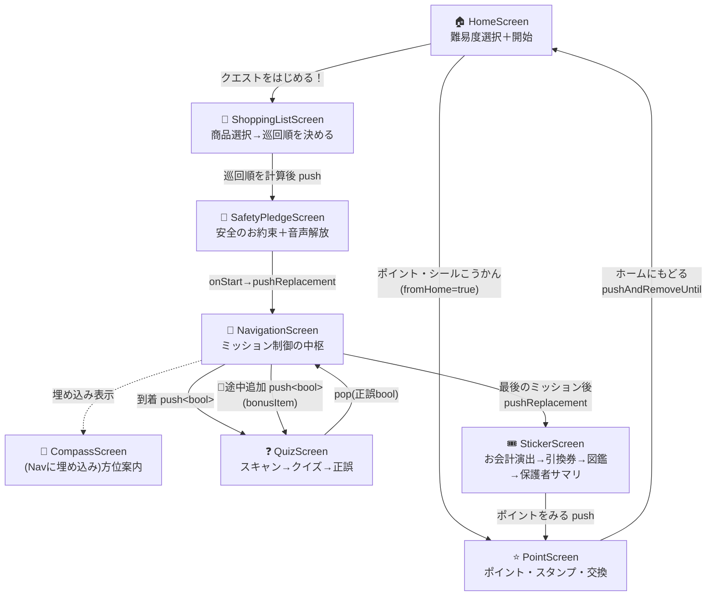
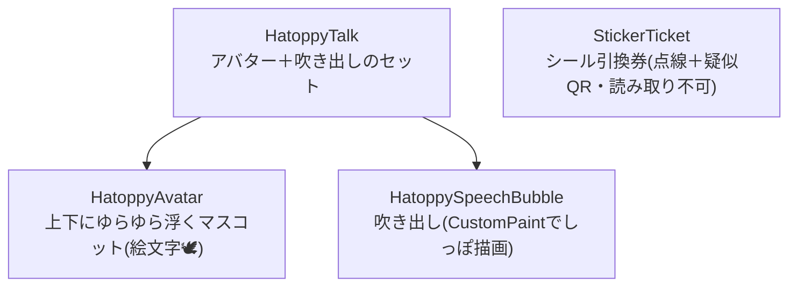

# 01. 画面フローと UI 層

スライドの「デモの流れ」「画面ごとの役割」パートで使う。**8画面＋共通部品**を、遷移フローチャートとともに説明する。

---

## 1. エントリポイントとテーマ

- `lib/main.dart`（約21行）: `main()` → `runApp(HatoNaviApp())`。`MaterialApp(home: HomeScreen())` を構築するだけ。**ルートテーブルは使わず、全遷移は `Navigator.push` / `MaterialPageRoute` の命令的ナビゲーション**。
- `lib/theme.dart`: ブランドカラーを `AppColors` に集約。`buildAppTheme()` が Material 3 + `ColorScheme.fromSeed(primaryGreen)` を返す。
  - 平和堂イメージの**グリーン基調**＋マスコット「はとっぴー」の**オレンジ/黄色**アクセント。
  - 角丸・大きめ文字・太字で**低年齢児童向けのやさしいトーン**に統一。

---

## 2. 画面遷移フローチャート（全体像）

**遷移設計の勘所**
- 「お約束 → ナビ」「ナビ → 完了」は `pushReplacement` で**前に戻れないように置換**（走り出し防止・誤操作防止）。
- 最後にホームへ戻るときは `pushAndRemoveUntil` で**履歴を全破棄**。
- QuizScreen は `Navigator.pop(true/false)` で**正誤を呼び出し元に返す**。正解のときだけバッジ収集・ポイント加算。

---

## 3. 画面ごとの役割

### 🏠 HomeScreen（`screens/home_screen.dart`）
- アプリの入口。マスコット＋説明、**クイズ難易度セレクタ（3段階チップ）**、「クエストをはじめる！」「ポイント・シールこうかん」の2導線。
- `initState` で `LevelService.load()`、チップ選択で `LevelService.save(id)`（永続化＋同期キャッシュ更新）。

### 🛒 ShoppingListScreen（`screens/shopping_list_screen.dart`）
- `sampleItems`（8品）から買う商品を複数選択 → **「AIがまわる順番を考える」**演出（最低1.2秒）→ お約束画面へ。
- **巡回順ロジック（ローカル＋AI）**:
  - ローカル順 = 売り場 `pathIndex`（入口→レジの一方向スイープ）昇順。
  - `GeminiService.suggestVisitOrder()` の結果は、**全商品を漏れなく含み・後戻り回数がローカル順以下のときだけ採用**（回遊性ガード）。失敗時はローカル順。
- ※「最短/最適ルート」ではなく「**回る順番の並べ替え**」である点に注意。

### 🤝 SafetyPledgeScreen（`screens/safety_pledge_screen.dart`）
- 親が子にスマホを渡す前の「おやくそく画面」。`StatelessWidget` で自身は遷移を持たず、`onStart` コールバックのみ受け取る。
- スタートボタンで **`SpeechService.unlock()`**（iOS の音声をユーザー操作起点で解放）→ `onStart()`。

### 🧭 NavigationScreen（`screens/navigation_screen.dart`）— ミッション制御の中枢
- 「次の1売り場だけ」をミッション形式で提示し、`CompassScreen` を埋め込み表示。到着ごとに `QuizScreen` を挟む。
- `_index`（現在ミッション）、`_collected`（正解で集めた品）、`_hazardShown`（危険アラート済み）を管理。
- **方位角計算**: 1つ前の売り場 → 今回の売り場の座標差から `atan2(dx, dy)` で北基準の方位角を算出し、`CompassScreen` に渡す（AIではなくローカル計算）。
- **距離の目安ヒント**: 同じ座標差から直線距離 `sqrt(dx²+dy²)` を求め、`≤15→「すぐ ちかく！」`・`≤40→「ちょっと あるくよ」`・`>40→「ずっと むこうだよ！」` のひらがな文を `CompassScreen` に渡す。**経路（最短/最適ルート）ではなく距離感の演出**。
- **危険アラート**: 2ミッション目到達時に一度だけ、赤いダイアログ＋ `SpeechService.speak()`。
- **途中追加（🛒）**: AppBar のアイコンから `bonusItem` のクイズを起動（リスト外商品の「みつけた！」）。**同一 `bonusItem` は二重加算しない**ガードあり（図鑑の分母超過・バッジ重複を防止。既発見なら「もう はっけんずみ」表示）。

### 🧭 CompassScreen（`screens/compass_screen.dart`）
- `Scaffold` を持たず Nav に埋め込まれる。次の売り場への方角を**大きな針**で表示し、「ここに とうちゃく！」で `onArrived` を呼ぶ。
- `CompassService.headingStream`（方位）と `MotionService.runningStream`（走行）を購読。
- **針角度** = `targetBearing + storeNorthOffset − heading`。0/360 の折り返しは最短回りで処理。
- **距離ヒントチップ**: 受け取った `distanceHint`（「すぐ ちかく！」等）を🚶チップで表示。矢印だけで遠さに不安にならないよう添える演出（null/空なら非表示）。
- **較正「むきを あわせる」**: いまの前方を目的地方向とみなして `storeNorthOffsetDeg` を再設定（static で全ミッション保持）。
- **走行ロック**: 走行検知で全面赤の「とまって！」オーバーレイ＋音声。

### ❓ QuizScreen（`screens/quiz_screen.dart`）
- **`enum _Phase { idle, camera, adding, quiz, result }`** のフェーズ管理。
  - idle → camera（実カメラ `MobileScanner`）→ adding（裏で `GeminiService.generateQuiz(level)`）→ quiz → result。
- `_quiz?.xxx ?? widget.item.xxx` の getter で、**AI生成→失敗時は固定クイズ**へ透過的にフォールバック。
- 「おうちのひとと いっしょに かくにん」注意書き、正解時のみ限定バッジ表示。最後に `pop(正誤)`。

### 🎟️ StickerScreen（`screens/sticker_screen.dart`）
- お会計演出 → **シール引換券**（疑似QR・読み取り不可のデザイン）→ **ご当地はとっぴー図鑑**（獲得バッジをグリッド表示）→ **「おうちのひとへ きょうのまなび」保護者サマリ**。
- `initState` で `PointService.add(earnedPoints)` を一度だけ実行（獲得ポイントを累計へ加算）。
- **保護者サマリ（AI）**: `GeminiService.generateParentSummary(collected)` で、今日学んだ商品の `explanation` だけを根拠に保護者向けの振り返り文を生成。**失敗・空のときは固定文 `_fallbackSummary` を表示してカードを必ず埋める**（→ [04](04_AI連携とハルシネーション対策.md) §4.1）。

### ⭐ PointScreen（`screens/point_screen.dart`）
- 累計ポイント＋**スタンプカード**表示と**シール交換**。2系統から開く（完了後＝`earnedPoints>0` / ホームから＝`fromHome=true`）。
- 交換は `PointService.redeem()`（しきい値10ポイントを差し引き）。`onBackToHome` で戻り方（pop か全破棄）を呼び出し元に委ねる。

---

## 4. 共通ウィジェット（`widgets/`）

- **画像アセット不要**で全て絵文字＋描画ベース。`HatoppyTalk` は CompassScreen・QuizScreen の「はとっぴーが話す」演出に使用。
- `StickerTicket` は PointScreen の交換ダイアログで使用。
- ※ StickerScreen は同等の引換券UIをファイル内にローカル再定義しており、共通 `StickerTicket` とは別実装（軽微な重複。改善候補）。

---

## 5. 状態管理の方針

- 外部状態管理ライブラリは使わず、**各画面の `StatefulWidget` + `setState`** に閉じる。
- 画面をまたぐ状態（ポイント累計・難易度・コンパス較正値）は、**サービス層の永続化／static キャッシュ**で共有。
  - 例: `LevelService.currentId`（同期参照キャッシュ）、`CompassService.storeNorthOffsetDeg`（static で全ミッション保持）、`PointService`（`shared_preferences`）。

---

### スライド構成の目安（この章）
1. **画面遷移フローチャート**（§2）を1枚で見せる＝デモの全体像
2. 主要4画面（List / Navigation / Quiz / Sticker）を各1枚で
3. 安全配慮の画面（Pledge / 走行ロック）を強調
4. 共通部品とテーマ（やさしいUIトーン）
