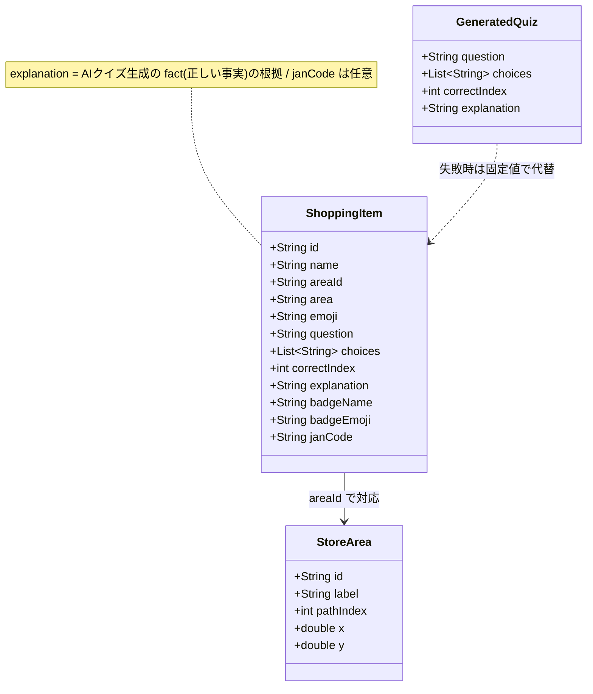

# 02. データモデル層（`lib/models.dart`）

スライドの「データの持ち方」パートで使う。本番では商品マスタ・クイズDBから取得する想定だが、**デモ用に固定データを直書き**している。

---

## 1. クラス図（モデル全体）

> 各フィールドの意味は下表のとおり。`ShoppingItem.explanation`（豆知識）が AIクイズの根拠になる点がハルシネーション対策の起点。

- 全フィールド `final` の不変オブジェクト。`janCode` のみ任意（デモ未設定可）。
- `explanation`（豆知識）は **AIクイズ生成の「正しい事実(fact)」の根拠**として再利用される（→ [04](04_AI連携とハルシネーション対策.md)）。ここがハルシネーション対策の起点。

---

## 2. 固定データの内訳

| データ | 型 | 件数 | 役割 |
|---|---|---|---|
| `sampleItems` | `List<ShoppingItem>` | **8品** | おつかい対象の商品＋クイズ＋バッジ |
| `bonusItem` | `ShoppingItem` | 1 | リスト外商品の「途中追加」用ボーナスクイズ |
| `storeAreas` | `Map<String, StoreArea>` | **25区画** | 店内売り場マスタ（`売り場マップ.pdf`をデジタル化） |
| `hazardAlerts` | `List<String>` | 2 | 危険箇所の音声/ダイアログ文言 |

### サンプル8品（`sampleItems`）
| # | 商品名 | 売り場 | 絵文字 | バッジ |
|---|---|---|---|---|
| 1 | みずうみ農園の トマト | 地場野菜 | 🍅 | やさいはとっぴー |
| 2 | あおぞら牧場の ぎゅうにゅう | 乳製品 | 🥛 | ぎゅうにゅうはとっぴー |
| 3 | やまびこ農園の たまご | 卵 | 🥚 | たまごはとっぴー |
| 4 | あおぞら牧場の ヨーグルト | ヨーグルト | 🥣 | ヨーグルトはとっぴー |
| 5 | こむぎ工房の パン | パン | 🍞 | パンはとっぴー |
| 6 | みのり牧場の おにく | お肉 | 🥩 | おにくはとっぴー |
| 7 | みなと水産の おさかな | お魚 | 🐟 | おさかなはとっぴー |
| 8 | ひだまり農園の くだもの | 果物 | 🍎 | くだものはとっぴー |

- 商品名は**架空ブランド＋一般名**で、特定の実産地・実在商品に依存しない。
- クイズは「地元でとれたものは新鮮で、生産者の応援になる」という**食育メッセージ**。低学年向けはひらがな多め。

---

## 3. 売り場マスタ `storeAreas`（25区画）と座標系

- `pathIndex` は **入口（start）→ レジ（cashier）を一方向にめぐる並び順**（0〜24）。巡回順の基準になる。
- 座標系: `x` は左→右で 0..100、`y` は下→上で 0..100。原点は左下、**x が東/右・y が北/上**。座標は**実マップの比率に合わせて精緻化済み（小数値）**。
- 右壁は下→上に進むため、`pathIndex` は **地場野菜(1)→果物(2)→野菜(3)→お魚(4)**（果物と野菜は物理配置に合わせて入れ替え済み）。
- 同名で複数ある区画（お魚・野菜・果物は地図上に2つ）は、**動線から到達しやすい側の1つを代表座標**に採用。
- 用途: NavigationScreen が「1つ前の売り場 → 次の売り場」の**方位角（bearing）と距離の目安をローカル計算**するのに使う。

```mermaid
flowchart LR
  S["start (86.8,6.5)"] --> V1["地場野菜 (76.4,10.8)"] --> F["果物 (85.5,20.3)"] --> V["野菜 (84.8,53.7)"]
  V --> Fi["お魚 (89.1,92.8)"] --> M["お肉 (50.5,93.1)"] --> T["天ぷら (10.8,93.1)"]
  T --> Sd["惣菜 (9.6,79.7)"] --> D["乳製品 (25.1,68.8)"] --> Y["ヨーグルト (9.1,65.6)"]
  Y --> Fr["...冷凍/飲料/味噌/即席/豆腐..."] --> Ic["アイス・酒・菓子・台所・ゴミ袋"]
  Ic --> E["卵 (9.1,58.1)"] --> B["パン (9.3,35.6)"] --> Sc["セルフレジ (18.8,11.8)"] --> C["レジ (47.7,15.6)"]
```

> 巡回順は「物理的な通路ルート」ではなく、この `pathIndex` を基準にした**回る順番**。AIが順番を提案しても、検証＋回遊性ガードを通った場合だけ採用する。

---

## 4. ボーナス品 `bonusItem`

- リストにない商品を途中スキャンしたとき用。JAN→平和堂商品管理番号→商品DB の連携は今回権限がないため、**商品名が分からなくても出せる**「地産地消の一般クイズ」＋限定バッジ（はっけんはとっぴー🛒）を用意。
- `areaId: 'unknown'`（売り場マスタ外）。本文はひらがなでなく通常表記。

---

## 5. 発表での言い回し（注意）

- 「`explanation`（手書きの正しい事実）をAIに渡して、それだけを根拠に出題させる」→ **ハルシネーション対策の核**として強調できる。
- 「商品・売り場は固定データだが、本番は商品マスタ／クイズDB／JAN連携に差し替え可能」と将来像を添える（架空名はデータ差し替えのみで変更可）。

---

### スライド構成の目安（この章）
1. **クラス図**（§1）＋「explanation が AI の根拠になる」一言
2. 固定データ内訳表（§2）
3. 売り場マスタ＋座標系（§3）— 方位計算がローカルである根拠
