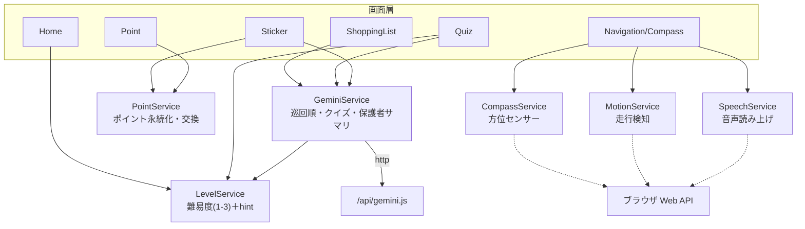
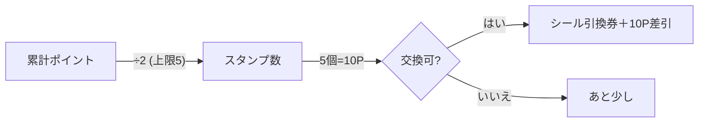
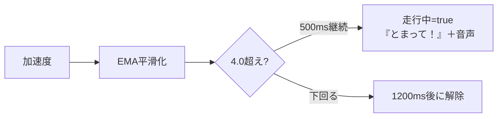

# 03. サービス層（`lib/services/`）

スライドの「ロジック」「センサー・安全機能」パートで使う。6サービスはいずれも**静的メソッド中心**で、画面から手軽に呼べる。共通テーマは「**デモが止まらない安全設計**」。

---

## 1. サービス依存図

| サービス | 永続化キー | 依存パッケージ | 種別 |
|---|---|---|---|
| GeminiService | — | `http` | AI連携 |
| LevelService | `quiz_level` | `shared_preferences` | 設定 |
| PointService | `total_points` | `shared_preferences` | 永続化 |
| CompassService | —（static変数） | dart:html / js_util | センサー(Web) |
| MotionService | — | dart:html / js_util | センサー(Web) |
| SpeechService | — | dart:html | 音声(Web) |

---

## 2. GeminiService（AI連携）
- メソッドは3つ：
  - `suggestVisitOrder(items)` → 巡回順（id配列）／`mode: order`
  - `generateQuiz(item, {level})` → `GeneratedQuiz?`／`mode: quiz`
  - `generateParentSummary(items)` → `String?`（完了画面の保護者サマリ）／`mode: summary`
- 同一オリジン `/api/gemini` へ POST、**タイムアウト8秒**。失敗・不正・例外は **null** を返し、呼び出し側が固定データ／固定文へフォールバック。
- 詳細・検証ロジックは [04_AI連携とハルシネーション対策.md](04_AI連携とハルシネーション対策.md)。

---

## 3. LevelService（クイズ難易度）
- 3段階の難易度を定義。各レベルは `id` / `label`（画面表示）/ `hint`（**Geminiに渡す難易度指示文**）を持つ。
- `shared_preferences`（キー `quiz_level`）で永続化。**`currentId` は同期参照用メモリキャッシュ**（クイズ生成時など await できない場面で即時参照）。不正値は既定（=2 小学生）へ丸める。

| level | label | hint の要点 |
|---|---|---|
| 1 | 未就学（〜6さい） | とてもやさしく・全部ひらがな・短い文・選択肢3〜4語 |
| 2 | 小学生（1〜3年）★既定 | やさしい日本語・低〜中学年向け・素直な4択 |
| 3 | 高学年（4〜6年） | **高学年で習う常用漢字を使う（新鮮・鮮度・輸送・生産者・地産地消・旬 等）／ふりがな無し／理由・仕組みを考えさせる**。ただし事実外を足さない・断定/専門用語/下品はNG |

> hint 側にも「事実に無いことを足さない」制約を入れており、難易度を上げてもハルシネーションが増えない設計。

---

## 4. PointService（ポイント・スタンプ・シール交換）
- ルール: **2ポイント=1スタンプ**、**5スタンプ=シール1枚（=10ポイント）**。`shared_preferences`（キー `total_points`）に累計を永続化。
- `add(p)`（加算）／`stampsFor(total)`（0〜5に頭打ち）／`canRedeem(total)`（10P以上か）／`redeem()`（10P差引）。
- しきい値は定数の積（`pointsPerStamp * stampsToRedeem`）で定義し、画面側も同じ定数で残量・交換可否を表示。

---

## 5. CompassService（方位センサー・Web専用）
- ブラウザの DeviceOrientation を購読し、**北=0 の 0〜360度方位**を `headingStream` で配信。
- **円環スムージング**: 角度を単位ベクトル(cos,sin)に直して指数移動平均（係数0.2）。0/360 境界でも破綻しない。1度未満の変化は出さず針のチラつきを防止。
- **方式の非混在**: 絶対方位（`deviceorientationabsolute` の alpha）を最優先。iOS Safari は `webkitCompassHeading`。相対のみのイベントは信用せず捨てる（象限ズレ防止）。
- **較正用の static**: `storeNorthOffsetDeg`（店舗の北と地磁気北のズレ。ワンタップ較正で更新し全ミッション保持）。iOS 13+ は `requestPermission()` をタップ起点で呼ぶ。
- **非対応端末**: 北固定（0）を1回流して通常進行。

---

## 6. MotionService（走行検知・安全配慮・Web専用）
- 加速度センサー（DeviceMotion）で「子どもの歩行を超えた動き（早歩き・走り）」を検知し、`runningStream`（走行中=true）を配信 → 走行ロックUIに使う。
- **しきい値 4.0 m/s²（重力除外の合成加速度）が 0.5秒継続**したら発火。単発の衝撃では誤発火しない。
- 誤発火・チラつき対策の三段構え: ①EMA平滑化 ②継続時間判定（500ms）③解除は落ち着いてから1200ms待つ。
- **非対応・未許可端末では何も流さない** → ロックは出ず通常進行（デモが止まらない）。

---

## 7. SpeechService（音声読み上げ・Web専用）
- Web Speech API（`speechSynthesis`）で日本語テキストを読み上げ。危険アラート・走行ロックの音声に使う。
- **`unlock()`**: iOS Safari は最初のユーザー操作起点でないと鳴らないため、お約束画面のスタート時に無音発話でウォームアップ（音声“解放”）。
- **`speak(text)`**: 絵文字/改行を除去・整形し、`ja` で始まるボイスを優先選択。直前の発話を `cancel()` してから話す（重なり防止）。
- 非対応ブラウザ・例外時は無音で続行。
- **既知の課題**: iOS のサイレントスイッチON時は端末仕様で鳴らない。

---

## 8. 横断テーマ（発表での締め）
1. **フォールバック思想**: 全サービスが「失敗しても体験を止めない」（null/北固定/無流し/無音）。`catch(_)` で例外を握りつぶす。
2. **ハルシネーション対策**: グラウンディング＋検証＋null フォールバック＋hint側の制約。
3. **永続化と同期キャッシュ**: `shared_preferences` をキー単位で。`LevelService.currentId` は同期参照用。
4. **Web専用＋ネイティブ移行を見据えた抽象**: compass/motion/speech は公開API（`headingStream`/`runningStream`/`requestPermission`/`speak`）を保ったまま `sensors_plus`/`flutter_tts` 等へ差し替え可能と冒頭コメントに明記。

---

### スライド構成の目安（この章）
1. **サービス依存図**（§1）
2. ポイント計算ロジック（§4 の図）
3. **方位・走行・音声の安全3点セット**（§5〜7）を「測位ハードなしで安全を実現」として強調
4. 横断テーマ＝設計思想（§8）
