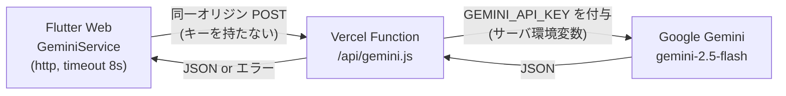
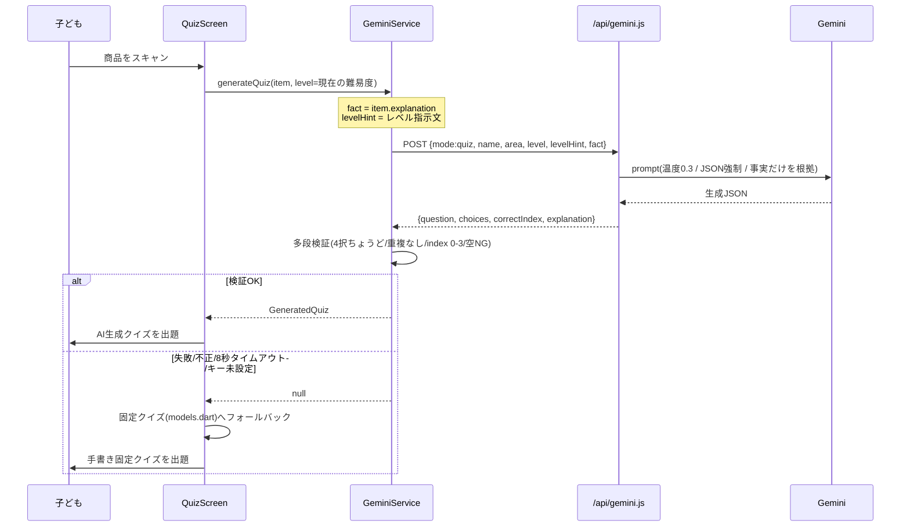
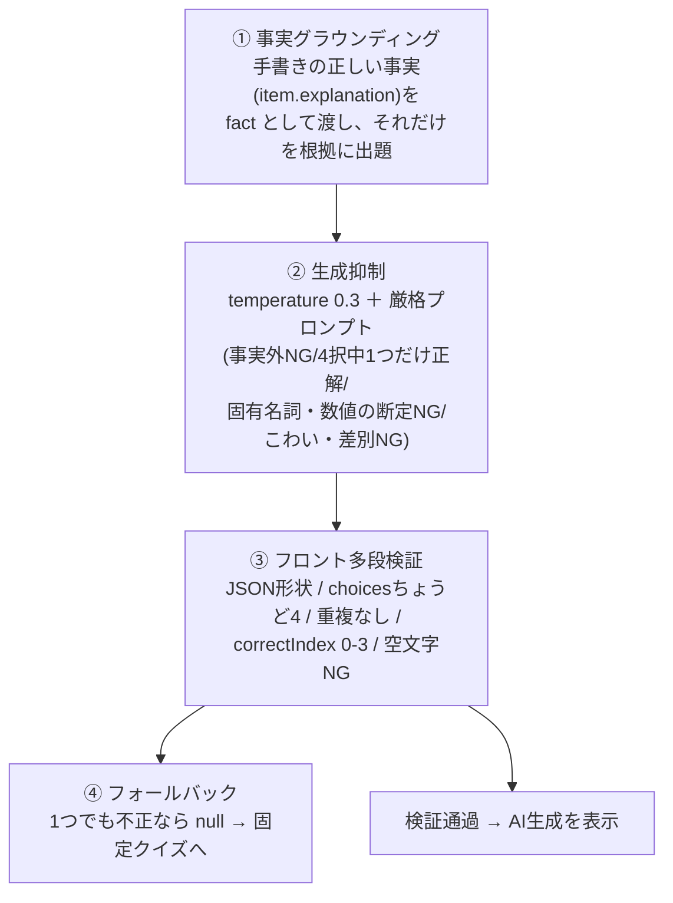
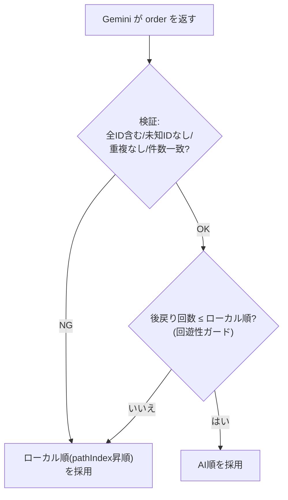

# 04. AI（Gemini）連携とハルシネーション対策

**技術的な目玉であり、質疑で必ず突かれるポイント**。「AIに何をさせ／させないか」「誤情報をどう防ぐか」を明確に。

---

## 1. AI の用途は3つ（いずれも「検証・やり直しがきく」仕事だけ）

| 用途 | mode | 入力 | 出力 | 呼ぶタイミング |
|---|---|---|---|---|
| ① 巡回順の提案 | `order` | 買い物リスト `[{id,name,areaId}]` | `{order:[id,...]}` | 買い物リスト確定時に1回 |
| ② 食育クイズ生成 | `quiz` | 商品名・売場・難易度・**正しい事実(fact)** | `{question, choices[4], correctIndex, explanation}` | 商品スキャン時に1回 |
| ③ 保護者サマリ生成 | `summary` | 学んだ商品 `[{name,area,explanation}]` | `{summary:"本文"}` | 完了画面で1回（「おうちのひとへ きょうのまなび」） |

> ❌ AIに「現在地推定・通路ルート生成・方角計算・危険判定・画面遷移・スキャン・精算」はさせない。
> ❌ ナビ中に毎回呼ばない。物理ルートや「最短/最適」は生成しない（提案するのは**回る順番**だけ）。
> ✅ 3用途はすべて**事実グラウンディング＋失敗時フォールバック**つき。危険なこと（方角・安全・進行・お金）はローカルが確実に行う、という原則は変わらない。

---

## 2. 通信経路（APIキーの秘匿）

- **`GEMINI_API_KEY` はフロントに出さない**。Vercel の環境変数に置き、サーバ側 Function だけが知る。
- フロントは同一オリジンの `/api/gemini` を叩くだけ（CORS・キー管理を Function が吸収）。
- Function は `responseMimeType: 'application/json'` で**JSON出力を強制**。

---

## 3. クイズ生成のシーケンス（フォールバック込み）

**要点**: ユーザーに出るのは「**検証を通ったAI生成クイズ**」か「**手書き固定クイズ**」のどちらか。中途半端な誤クイズは画面に出ない。

---

## 4. ハルシネーション対策＝多層防御（4層）

| 層 | 実装場所 | 効果 |
|---|---|---|
| ① グラウンディング | `gemini_service.dart`（fact を渡す）＋ `api/gemini.js`（プロンプト） | AIに事実を発明させない |
| ② 生成抑制 | `api/gemini.js`（temperature 0.3＋プロンプト規則） | 創作の暴走・断定を抑える |
| ③ 多段検証 | `gemini_service.dart`（生成結果のバリデーション） | 構造的に壊れた出力を弾く |
| ④ フォールバック | `quiz_screen.dart`（null時は固定クイズ） | 誤クイズを表示しない |

さらに難易度 `hint`（`level_service.dart`）にも「**事実に無いことを足さない／断定・専門用語・下品はNG**」を明記し、難易度を上げてもリスクが増えないようにしている。

### 4.1 保護者サマリ（`mode: summary`）も同じ思想で守る
完了画面の「おうちのひとへ きょうのまなび」も AI 生成だが、クイズと同じ多層防御を適用する。

- **① グラウンディング**：子どもが今日学んだ商品の `explanation`（手書きの正しい事実）**だけ**を根拠に渡す。
- **② 生成抑制**：`temperature 0.4`＋「学んだことに書かれていないことは書かない／断定・誇張しない／2〜3文の自然な日本語」と厳格指示。
- **③ 検証**：返り値が**空でない文字列か**を確認（`gemini_service.dart` の `generateParentSummary`）。
- **④ フォールバック**：失敗・空・キー未設定・空リスト時は**固定のまとめ文**（`sticker_screen.dart` の `_fallbackSummary`）を表示し、保護者カードを絶対に空にしない。

> ※ temperature は order(0.7) > summary(0.4) > quiz(0.3)。事実の硬さに応じて自由度を変えている。

---

## 5. 巡回順の検証と「回遊性ガード」

クイズと同様、巡回順も**AIを鵜呑みにしない**。

- AI順は「全商品を漏れなく含み、かつ**後戻り（pathIndex が逆行する回数）がローカル順以下**」のときだけ採用。
- 失敗・不正・キー未設定なら、入口→レジの一方向スイープ（ローカル順）に自動フォールバック。

---

## 6. 想定 Q&A（発表対策）

- **Q. AIが嘘の食育情報を出さない？** → 出さない。手書きの事実だけを根拠に出題し（グラウンディング）、温度0.3＋検証＋失敗時フォールバックの4層で守る。ユーザーには検証済みAI生成か固定クイズしか出ない。
- **Q. APIキーは安全？** → フロントに出さない。Vercel 環境変数に置き、サーバ Function だけが使う。
- **Q. ネットが切れたら？** → 8秒タイムアウトで固定クイズ／ローカル巡回順にフォールバック。デモは最後まで動く。
- **Q. AIがルート（経路）を作っている？** → いいえ。AIは「回る**順番**の提案」だけ。方角計算・距離の目安・通路ルート・現在地推定はローカル（端末内）処理。
- **Q. 完了画面の保護者まとめもAI？嘘を書かない？** → AI生成だが、子どもが今日学んだ事実(`explanation`)だけを根拠にし（グラウンディング）、温度0.4＋「学んだこと以外は書かない」指示＋失敗時は固定文へフォールバック。空のカードは出さない。

---

### スライド構成の目安（この章）
1. AIの用途は3つ（§1）＋「させないこと」リスト
2. **通信経路図**（§2）— キー秘匿
3. **シーケンス図**（§3）— フォールバック込み
4. **多層防御図**（§4）— ここが目玉
5. 想定Q&A（§6）を補足スライド/手元メモに
