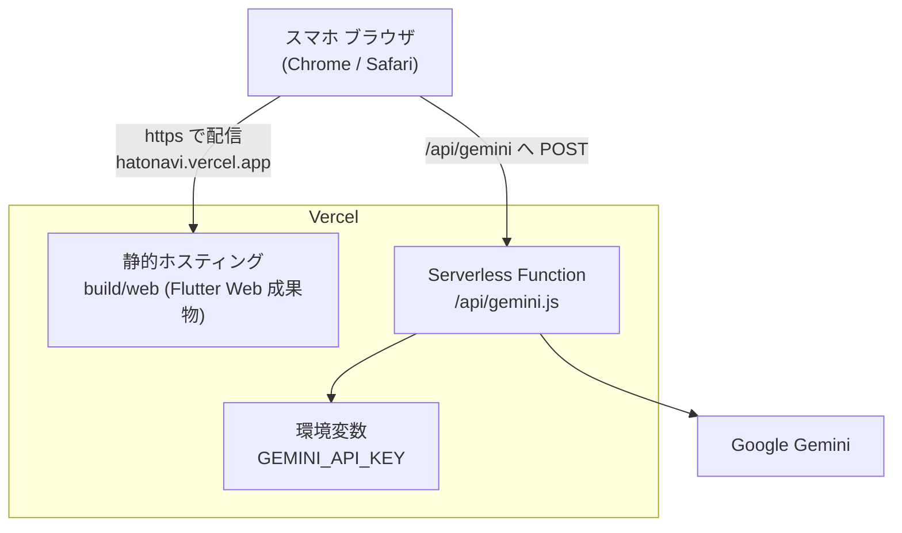
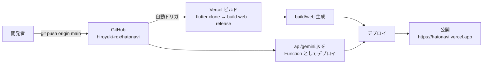

# 05. インフラ・ビルド・デプロイ

スライドの「どうやって公開しているか」「運用」パートで使う。**サーバ管理ほぼゼロ**で公開・自動デプロイできる構成。

---

## 1. 構成（Vercel 1本）



- **同一オリジン**でフロント（静的）と API（Function）を配信するため、CORS やキー露出の問題が起きにくい。
- HTTPS 配信なので、カメラ・方位/加速度センサーの権限が使える（センサー系は HTTPS 必須）。

---

## 2. `vercel.json` の意味

```json
{
  "buildCommand": "git clone https://github.com/flutter/flutter.git --depth 1 -b stable _flutter && _flutter/bin/flutter config --no-analytics && _flutter/bin/flutter build web --release",
  "outputDirectory": "build/web",
  "rewrites": [
    { "source": "/((?!api/).*)", "destination": "/index.html" }
  ]
}
```

| 設定 | 意味 |
|---|---|
| `buildCommand` | Vercel に Flutter SDK が無いため、**stable を浅く clone してから `flutter build web --release`**。 |
| `outputDirectory` | 公開対象は `build/web`（Flutter Web の成果物）。 |
| `rewrites` | `/api/` 以外の全パスを `index.html` に流す**SPAフォールバック**。`api/` は除外され `api/gemini.js`（Function）に届く。 |

> `build/web` は **`.gitignore` で Git 管理外**。リポジトリにビルド成果物は入れず、**Vercel が毎回ビルドして生成**する。

---

## 3. デプロイパイプライン（main push で自動）



- 流れ: **`main` に push → Vercel が自動でビルド → 公開**。手動デプロイ作業は不要。
- `GEMINI_API_KEY` は Vercel 環境変数に設定済み（変更時は再デプロイで反映）。

---

## 4. ローカルでのビルド/確認

| 操作 | コマンド / 方法 |
|---|---|
| Web リリースビルド | `flutter build web --release`（Windows はシンボリックリンク警告が出るが成功する） |
| 静的解析 | `flutter analyze`（`dart:js_util` の error 2件は compass/motion の**解析偽陽性**＝無視可・実害なし） |
| 実機確認 | スマホの Chrome/Safari で公開URL。カメラ・センサーを許可。iOS は方位/カメラ権限がタップ起点、サイレントON だと音声は鳴らない |

> ローカル実行では `/api/gemini` が存在しないため、AIは呼ばれず**固定データにフォールバック**して動く（デモは成立する）。

---

## 5. Web 構成（`web/`）

- `index.html`: Flutter 標準テンプレートほぼそのまま（`flutter_bootstrap.js` を async 読み込み）。
- `manifest.json`: PWA マニフェスト。`display: standalone`、`orientation: portrait-primary`（**縦固定**）。
- ※ タイトル/説明等の一部は新規作成時の既定値のまま（必要なら最終調整候補）。

---

## 6. プライバシー・セキュリティ面（発表で触れると良い）

- **APIキーをフロントに出さない**（Vercel 環境変数＋サーバ Function）。
- 子どもの**位置情報・カメラ映像をサーバへ送らない**（センサー/カメラは端末内で完結。GPS/BLE/Wi-Fi 測位は使わない方針）。
- 売り場マップ画像は実行時に読まず、開発時に座標データ化済み（AIにも渡さない）。

---

### スライド構成の目安（この章）
1. **構成図**（§1）— Vercel 1本でフロント＋API＋キー秘匿
2. **デプロイパイプライン図**（§3）— main push で自動公開
3. プライバシー/セキュリティの3点（§6）
