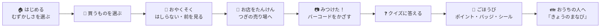
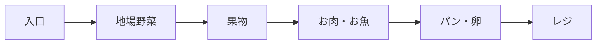
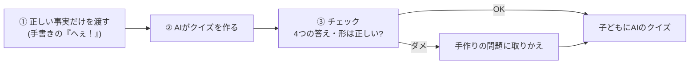

# 鳩ナビ おつかいクエスト
## ― いちばんやさしいアプリ説明 ―

> このアプリを、はじめての人にもパッと分かるように説明します。
> むずかしい言葉は使いません。くわしい技術の話は最後のページで案内します。

---

# 1. これ、なに？（ひとことで）

**スーパーの買い物を、子どもが楽しめる「おつかいの冒険」に変えるアプリです。**

買い物リストが、**宝の地図**になる ―― そんなイメージです。
子どもがスマホを持って売り場をまわり、商品を見つけてクイズに答え、ポイントやシールを集めます。

- インストール不要。**URLを開くだけ**でスマホのブラウザで動きます。
- 公開中：`https://hatonavi.vercel.app`

---

# 2. だれの、どんな こまりごとを 解決？

買い物の「困った」を、関わる3人みんなのうれしさに変えます。

| だれ | こまりごと | このアプリで |
|---|---|---|
| 👩‍👧 **親** | 子どもがぐずる・走り回る。動画を見せる罪悪感 | 子どもが**自分から参加**。買い物に集中できる |
| 🧒 **子ども** | 買い物に関われず、たいくつ | クイズ・バッジ・シールで**学びと達成感** |
| 🏬 **お店** | 子育て世代に**また来てほしい** | 「また行きたいお店」になる |

> 💡 ひとことで言うと「**買い物を、親子の楽しい時間に変える**」アプリです。

---

# 3. つかうと、こうなる（体験の流れ）

子どもの体験は、この一本道です。むずかしい操作はありません。

1. **はじめる**：おうちの人が、子どもの学年（むずかしさ）を選ぶ。
2. **買うものを選ぶ**：リストから今日買うものをタップ。
3. **おやくそく**：「はしらない・前を見る・大人のそばに」を確認。
4. **たんけん**：方位じしゃく（コンパス）の矢印で、つぎの売り場へ。
5. **みつけた！**：商品のバーコードをカメラでかざす（買い物の合図）。
6. **クイズ**：その食べものの「へぇ！」をクイズで学ぶ。
7. **ごほうび**：正解でポイント・バッジ。集めるとシールと交換。
8. **まとめ**：終わったら、AIが今日の学びをおうちの人にまとめます。

---

# 4. うれしいポイント（5つ）

このアプリの「いいところ」を5つだけ。

- 🧭 **迷わない** … 回る順番を、お店の並びにそって自動でならべる。
- 📚 **学べる** … 商品ごとに、地元の食べものの食育クイズ。
- 🛑 **安全** … 走ると画面が止まり、音声で「とまって！」。危ない場所も知らせる。
- 🏆 **集めて楽しい** … ポイント・ご当地バッジ・シールでやる気アップ。
- 👪 **親も安心** … 終わったら「今日なにを学んだか」をAIがまとめてくれる。

> 💡 「楽しい」だけでなく「**安全**」と「**学び**」も同時に ―― ここがいちばんの特長です。

---

# 5. きほんの しくみ（やさしく3つだけ）

「中で何をしているの？」を、たとえ話で3つだけ説明します。

## ① 回る順番 ＝ お店は“一本道のすごろく”

お店は入口からレジまで、ぐるっと**一方向**に回れるようになっています。
だから、買うものを**「棚の並び順」にならべるだけ**で、後戻りの少ない順番ができます。

> 💡 すごろくのマスを順番に進むイメージ。**むずかしい経路計算はしていません**。

## ② 方角 ＝ お店の地図に“住所”をつけている

売り場ごとに地図上の場所（座標）を覚えています。
「今いる売り場 → つぎの売り場」の向きを計算して、**矢印**にしています。
GPSは使いません（屋内でも“だいたいの方角”が分かればOK）。

## ③ クイズ ＝ “正しいことだけ”をAIに渡して作る

クイズの文章はAIが作りますが、**勝手な作り話はさせません**。
くわしくは次のページへ。

---

# 6. いちばん聞かれる：「AIは うそをつかない？」

> 💡 **たとえ話**：このAIは「**カンペ（正しい事実）だけを見て問題を作る先生**」です。
> カンペに書いていないことは書かせません。もし変な問題を作ったら、用意してある**手作りの問題に取りかえます**。

実際のしくみ（3ステップ）:

つまり、子どもに出るのは「**チェックを通ったAIの問題**」か「**手作りの問題**」だけ。
**まちがった問題は出ません**。終わりの「今日のまとめ」も、同じく正しい事実だけを使って作ります。

> 💡 もうひとつの安心：AI・ネット・センサーが止まっても、**用意した予備に切り替えて最後まで動きます**（エレベーターが止まっても階段があるイメージ）。

---

# 7. このアプリが大事にしている3つの考え

1. **やさしい言葉とUI** … 小さな子でも迷わない、大きな文字・絵・音声。
2. **止まらない作り** … 何かが失敗しても、予備に切り替えて体験を止めない。
3. **AIは得意なことだけ** … 「順番の提案・クイズ・まとめ」の3つだけ。方角・安全・進行はアプリが確実に行う。

---

# 8. もっとくわしく知りたい人へ（技術編）

このページまでが「やさしい説明」です。**ここから先は技術者向け**の資料があります。

- 機能ごとのフローチャート・構成図 → `鳩ナビ_機能別解説.pdf`
- 審査・質疑の想定問答（数値・根拠つき） → `鳩ナビ_技術想定QA.pdf`
- 教科書スタイルの入門 → `鳩ナビ開発入門_教科書.pdf`

> 段階的に：**まずこのページで全体像 → 必要な人だけ上の資料で深掘り**、という構成にしています。

---

<small>※ 本書は「分かりやすさ」を最優先に、専門用語を避け、ベネフィット（うれしさ）→ しくみ → 詳細の順で構成しています。</small>
