# 鳩ナビ おつかいクエスト ― 開発入門テキスト

### 〜 情報学部3年生のための、実プロダクトで学ぶソフトウェア設計 〜

> **本書について**
> 本書は、ハッカソンで開発された Flutter Web アプリ「鳩ナビ おつかいクエスト」を題材に、
> 実際のソフトウェアがどんな部品から成り、なぜそう設計されているのかを学ぶテキストです。
> プログラミングの基礎（変数・関数・クラス・HTTP・JSONくらい）を習った情報学部3年生を読者に想定し、
> Flutter・生成AI・センサーなどの専門用語はその都度かみくだいて説明します。

---

## 目次

- 第0章 この本の読み方と前提知識
- 第1章 鳩ナビとは何か（プロダクトの全体像）
- 第2章 全体アーキテクチャ ― ソフトウェアを「層」で考える
- 第3章 画面と画面遷移（UI層）
- 第4章 データの設計（モデル層）
- 第5章 サービス層 ― ロジック・センサー・音声
- 第6章 AI（Gemini）連携とハルシネーション対策【本書の山場】
- 第7章 インフラとデプロイ ― どうやって世界に公開するか
- 第8章 まとめ ― この開発から学べる設計の原則

---

# 第0章 この本の読み方と前提知識

このテキストは「上から順に読むと、1つのアプリが完成する筋道が分かる」ように並べています。各章の構成は次のとおりです。

- 🎯 **学習目標** … その章で何が分かるようになるか
- 本文 … 図と用語解説をはさみながら解説します
- 📘 **用語** … 知らないかもしれない言葉の説明
- ✅ **章末チェック** … 理解できたか確認する問い

> 📘 **用語：ハッカソン**
> 限られた期間（数日〜数週間）でチームがアイデアを形（動くソフト）にするイベント。
> 鳩ナビは「平和堂（スーパー）× ソフトバンク × 龍谷大学」のハッカソンで作られました。

前提知識は「Java や Python などで簡単なプログラムが書ける」「HTTP でサーバとやりとりすることをなんとなく知っている」程度で十分です。Flutter や生成AIを触ったことがなくても読めます。

---

# 第1章 鳩ナビとは何か（プロダクトの全体像）

> 🎯 **学習目標**：このアプリが「誰の・どんな課題を・どう解決するか」と、「AIに何をさせ、何をさせていないか」を説明できる。

## 1.1 どんなアプリか

**鳩ナビ おつかいクエスト**は、スーパーでの親子の買い物を「知育エンタメ（学びながら楽しむ遊び）」に変える **Flutter Web アプリ**です。子どもがスマホを持ち、

1. 売り場をまわって商品を探し、
2. 商品のバーコードをスキャンして「みつけた！」を記録し、
3. その商品にまつわる**食育クイズ**に答え、
4. ポイント・限定バッジ・シールを集める、

という流れで「お手伝いの冒険」を体験します。公開URLは `https://hatonavi.vercel.app` で、スマホのブラウザ（Chrome / Safari）で動きます。

> 📘 **用語：Flutter / Flutter Web**
> Google が作ったアプリ開発フレームワーク。1つのコード（Dart 言語）から iOS・Android・Web 向けアプリを作れます。
> このうち**ブラウザで動く形**に書き出したものが Flutter Web です。鳩ナビはアプリのインストール不要で、URLを開くだけで動きます。

## 1.2 解決したい課題（三方よし）

このアプリは、関わる3者すべてにメリットがある「三方よし」を狙っています。

| 対象 | 困っていること | 鳩ナビによる解決 |
|---|---|---|
| 親 | 買い物中に子どもがぐずる・走り回る。動画を見せる罪悪感 | 子どもが能動的に参加する「冒険」に変え、買い物に集中できる |
| 子ども | 買い物に関われず退屈 | クイズ・バッジ・シールで学びと達成感を得る |
| 店（平和堂） | 子育て世代の来店動機をつくりたい | 「また行きたい店」になり、ファンを増やす |

## 1.3 何を作り、何を作っていないか（重要）

ソフトウェアを理解するうえで「**やらないことを決める**」のはとても大切です。鳩ナビでは、生成AIにやらせることを意図的に**3つ**に絞っています（いずれも「あとで検証・やり直しがきく」仕事だけ）。

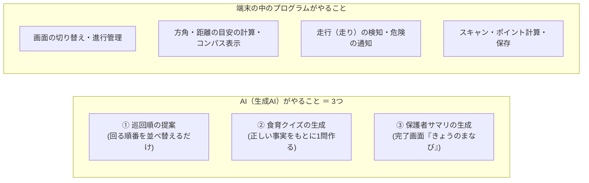

なぜ絞るのでしょうか。生成AIは「もっともらしいウソ」を混ぜることがあります（→ 第6章）。そこで、**間違えると危険なこと（方角・安全・進行・お金）はすべて自分のプログラムで確実に行い**、AIには「順番のアイデア出し」「クイズの文章づくり」「学びのふりかえり文づくり」という、間違えても検証・やり直しがきく仕事だけを任せています。どの3つも、後で見るように「正しい事実だけを根拠にさせる＋失敗したら固定文に切り替える」しくみで守ります。

> ✅ **章末チェック**
> 1. 鳩ナビは誰のどんな課題を解決しますか。3者あげて説明しましょう。
> 2. このアプリが生成AIに「させていないこと」を2つあげましょう。なぜさせないのですか。

---

# 第2章 全体アーキテクチャ ― ソフトウェアを「層」で考える

> 🎯 **学習目標**：アプリ全体を「層（レイヤー）」に分けて捉え、データがどこからどこへ流れるかを図で説明できる。

## 2.1 「層」で考えるとは

大きなソフトウェアは、役割ごとの**層（レイヤー）**に分けて整理します。鳩ナビは大きく4つの層に分かれています。

- **画面層（UI）**：ユーザーが見て触る部分（ボタン・文字・図）
- **サービス層**：計算・通信・センサーなど「裏方の仕事」
- **データ層**：商品やクイズなどの「情報の形」
- **外部（クラウド/ブラウザ機能）**：AIサーバやカメラ・センサー

層に分けると、「画面を直したいときはUI層だけ」「AIの呼び方を直したいときはサービス層だけ」と、**直す場所が局所的になり、バグが起きにくく**なります。これを**関心の分離**と呼びます。

> 📘 **用語：関心の分離（Separation of Concerns）**
> 「1つの部品は1つの役割だけ持つ」という設計の考え方。役割を混ぜないことで、読みやすく・直しやすくなります。

## 2.2 技術スタック（使っている道具）

| 層 | 使っている技術 | ひとことで言うと |
|---|---|---|
| 画面 | Flutter Web（Dart, Material 3） | 画面を作る道具 |
| 状態管理 | `StatefulWidget` + `setState` | 画面の状態を覚えて描き直すしくみ |
| 保存 | `shared_preferences` | 端末に小さなデータを残す（ポイント等） |
| カメラ | `mobile_scanner` | バーコードを読む |
| センサー・音声 | ブラウザのWeb API（方角・加速度・音声合成） | スマホのセンサーを使う |
| AI | Google Gemini（gemini-2.5-flash） | クイズ・順番を考える生成AI |
| サーバ | Vercel の Serverless Function | AIの鍵を隠す中継役 |
| 公開・自動化 | Vercel | 自動でビルドして公開する |

## 2.3 アーキテクチャ図

全体を1枚にすると次のようになります。矢印は「呼び出し・データの向き」です。

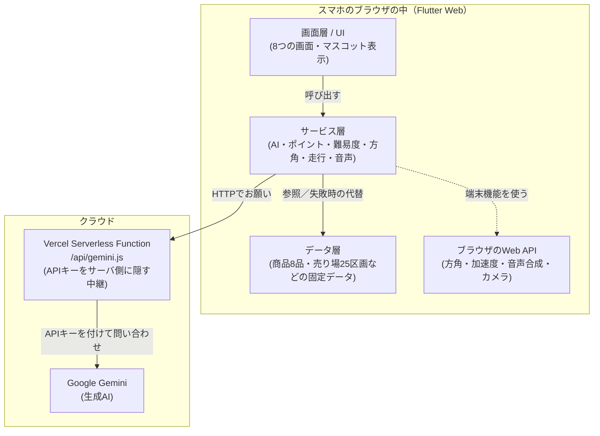

**読み解きのポイント**

- 画面は**サービス層にお願いするだけ**で、AIの細かい通信やセンサー処理を直接は知りません（関心の分離）。
- AIを呼ぶときは必ず**自前のサーバ（Vercel Function）を経由**します。これは「APIキー（AIを使うためのパスワード）」を利用者のブラウザに見せないためです（→ 第6・7章）。
- カメラ・センサー・音声は**端末の中だけ**で完結し、位置情報や映像をサーバへ送りません（プライバシー配慮）。

> 📘 **用語：クライアントとサーバ／Serverless Function**
> **クライアント**＝利用者側（ここではブラウザ）。**サーバ**＝要求に応える側。
> **Serverless Function**＝「自分で常時サーバを立てなくても、必要なときだけ動く小さなサーバ処理」。鳩ナビではAIへの中継だけを担います。

## 2.4 データの流れ（例：クイズを出すまで）

「商品をスキャン → クイズが出る」という1つの操作で、層をまたいで情報が流れます。

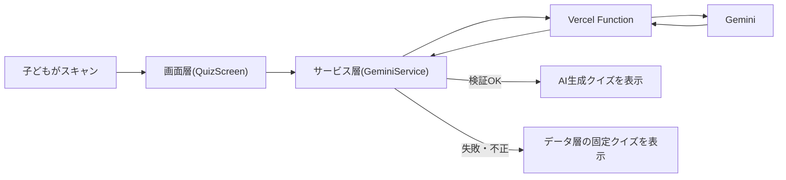

> ✅ **章末チェック**
> 1. 「関心の分離」とは何か、鳩ナビの例で説明しましょう。
> 2. なぜAIを直接ブラウザから呼ばず、サーバを経由するのですか。

---

# 第3章 画面と画面遷移（UI層）

> 🎯 **学習目標**：Flutterの「ウィジェット」と「状態管理」の基本を理解し、8画面がどうつながっているかを図で説明できる。

## 3.1 Flutterのウィジェットとは

Flutterでは、画面上のあらゆるもの（ボタン・文字・余白・画面そのもの）を**ウィジェット（部品）**として表します。ウィジェットを入れ子（ツリー状）に組み立てて画面を作ります。

> 📘 **用語：宣言的UI**
> 「今の状態だと画面はこう見える」と**結果を宣言**すると、フレームワークが差分を計算して描画してくれる方式。
> 「ボタンをここに置け、色を変えろ」と手順を命令する従来の方式（命令的）と対照的です。Flutter・React などが採用しています。

## 3.2 画面一覧（全8画面）

| 画面 | 役割 |
|---|---|
| HomeScreen | 入口。難易度を選んで開始 |
| ShoppingListScreen | 買う商品を選び、まわる順番を決める |
| SafetyPledgeScreen | 「走らない・前を見る」など安全のお約束 |
| NavigationScreen | 次の売り場へ案内（進行の中枢） |
| CompassScreen | 方位磁針で方角を示す（ナビに埋め込み） |
| QuizScreen | スキャン → クイズ → 正誤 |
| StickerScreen | お会計演出 → 引換券 → バッジ図鑑 |
| PointScreen | ポイント・スタンプ・シール交換 |

## 3.3 画面遷移フローチャート

画面の「つながり方」を図にしたものです。矢印のラベルは「どの操作で移るか」を表します。

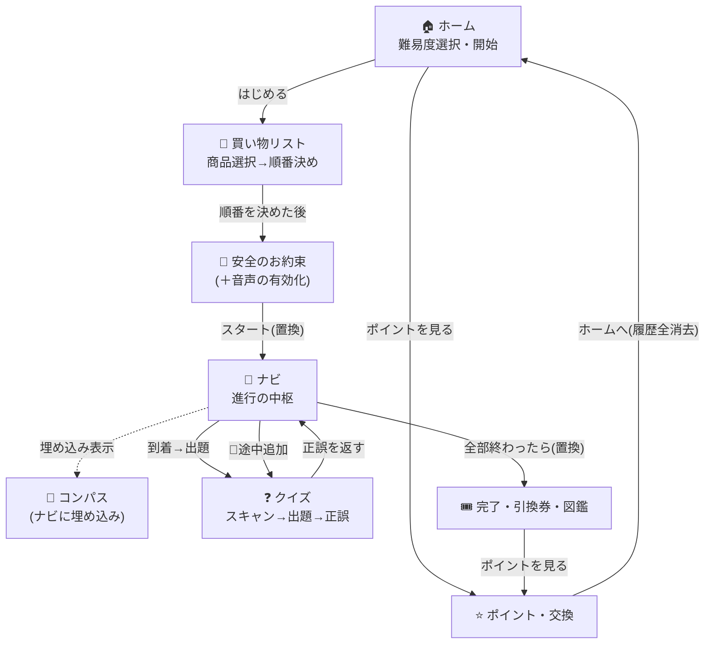

**設計のポイント**

- 「お約束 → ナビ」「ナビ → 完了」では、前の画面に**戻れないように置き換え**ています（`pushReplacement`）。子どもが誤って前に戻り、お約束を飛ばして走り出す、といった事故を防ぐためです。
- クイズ画面は「正解だったか（true/false）」を**呼び出し元に返します**。正解のときだけバッジとポイントが増えます。

> 📘 **用語：Navigator / push・pop・pushReplacement**
> 画面を「カードの山（スタック）」のように積み下ろしするしくみ。
> `push`＝上に重ねる、`pop`＝1枚はがして戻る、`pushReplacement`＝今の1枚を別の画面に差し替える（戻れなくなる）。

## 3.4 状態管理（setState）

画面が「いま何番目のミッションか」「正解したか」などを覚えておくしくみが**状態管理**です。鳩ナビは外部ライブラリを使わず、Flutter標準の `StatefulWidget` と `setState` だけで実現しています。

> 📘 **用語：setState**
> 「状態（変数）が変わったよ」とFlutterに知らせる命令。これを呼ぶと、その画面が**新しい状態で描き直され**ます。
> 例：クイズで「正解」を選ぶと `setState` で結果フェーズに切り替わり、お祝いの画面が現れます。

画面をまたいで共有したい情報（ポイントの累計・選んだ難易度・コンパスの補正値）は、画面ではなく**サービス層**に置いて共有します（次章・第5章）。

> ✅ **章末チェック**
> 1. 「宣言的UI」と「命令的UI」の違いを一言で説明しましょう。
> 2. なぜ「お約束→ナビ」で `pushReplacement`（戻れない遷移）を使うのですか。

---

# 第4章 データの設計（モデル層）

> 🎯 **学習目標**：アプリが扱う情報を「クラス」としてどう設計しているかを読み、固定データとフォールバックの関係を説明できる。

## 4.1 モデルクラス

「商品」や「売り場」といった情報のかたまりを、**クラス**として定義します。これを**モデル**と呼びます。

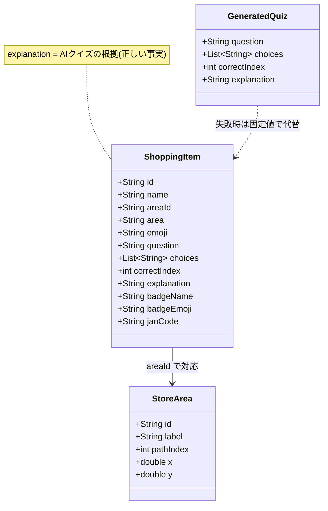

- `ShoppingItem`（おつかい1件）は、商品名・売り場・クイズ・正解・バッジをひとまとめに持ちます。
- `explanation`（豆知識）は、後で**AIにクイズを作らせるときの「正しい事実」のもと**になります。ここが第6章で重要になります。

> 📘 **用語：イミュータブル（不変オブジェクト）**
> 一度作ったら中身を書き換えないオブジェクト。鳩ナビのモデルは全フィールドが `final`（変更不可）です。
> 不変だと「いつの間にか値が変わっていた」というバグが起きず、安全に共有できます。

## 4.2 固定データとフォールバック

本来は商品データベースから取ってくる情報ですが、デモを確実に動かすため、ソースコード内に**固定データ**として書いてあります。

| データ | 件数 | 役割 |
|---|---|---|
| `sampleItems` | 8品 | おつかい対象の商品＋クイズ |
| `bonusItem` | 1 | リストにない商品をスキャンしたとき用 |
| `storeAreas` | 25区画 | 店内の売り場マップ（座標つき） |
| `hazardAlerts` | 2 | 危険箇所の注意文 |

この固定データは、**AIが失敗したときの「予備」**としても使われます。これを**フォールバック**といいます。

> 📘 **用語：フォールバック（縮退運転）**
> 本命の処理がダメだったときに切り替える「予備の処理」。
> 例：AIがクイズを作れなくても、固定の手書きクイズに切り替えれば体験は止まりません。

## 4.3 売り場マスタと座標

`storeAreas` は店内マップを数値化したもので、各売り場に「入口→レジへ向かう順番（`pathIndex`）」と「座標（x, y）」を持たせています。座標は実際のマップの比率に合わせて精緻化されています（小数値）。

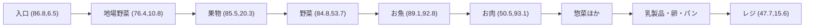

この座標を使って、アプリは「今いる売り場 → 次の売り場」の**方角と距離の目安を自分で計算**します（AIには計算させません）。距離は「すぐ ちかく！／ちょっと あるくよ／ずっと むこうだよ！」のやさしい言葉で子どもに伝えます。x は右が東、y は上が北です。

> ✅ **章末チェック**
> 1. `ShoppingItem.explanation` は何のために使われますか。
> 2. 「フォールバック」とは何か、鳩ナビの例で説明しましょう。

---

# 第5章 サービス層 ― ロジック・センサー・音声

> 🎯 **学習目標**：画面の裏で働く「サービス」の役割を理解し、ポイント計算とセンサー処理の工夫を説明できる。

## 5.1 サービス層の考え方

**サービス**は、画面から呼び出される「裏方の処理」をまとめた部品です。鳩ナビには6つのサービスがあります。

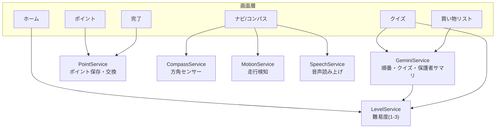

これらは多くが**static（共有）メソッド**で書かれ、どの画面からも手軽に呼べます。共通する思想は「**端末やネットが対応していなくても落ちない**」ことです。

## 5.2 ポイント計算

ルールは「2ポイント＝1スタンプ」「5スタンプ（＝10ポイント）でシール1枚と交換」。累計ポイントは `shared_preferences` に保存され、アプリを閉じても残ります。

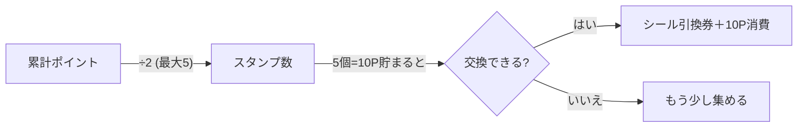

> 📘 **用語：永続化 / shared_preferences**
> アプリを閉じても消えないようにデータを保存すること。`shared_preferences` は「キーと値」で小さなデータを端末に残す簡単な保存庫です（ポイントや選んだ難易度を保存）。

## 5.3 方角センサー（円環スムージングという工夫）

スマホには「どちらが北か」を測るセンサーがあります。ただし生の値は細かく揺れて、針がチカチカしてしまいます。そこで2つの工夫をしています。

1. **角度を平均してなめらかにする**。ただし角度は 359°→0° と一周でつながっているため、単純な平均ではおかしくなります。そこで角度をいったん「向きベクトル（cos・sin）」に変換してから平均し、戻します（**円環スムージング**）。
2. **1度未満の変化は無視**して、チラつきを抑えます。

> 📘 **用語：EMA（指数移動平均）**
> 直近の値を重く、過去を軽く反映して平均する方法。`新しい平均 = 古い平均×0.8 + 今の値×0.2` のように計算します。
> ノイズ（雑音）をならして、動きをなめらかにするのによく使われます。

さらに、地磁気の北と「店のマップ上の北」はズレることがあるため、「むきを あわせる」ボタンで一度補正すれば、その値を全ミッションで使い回します。

## 5.4 走行検知（安全のしくみ）

加速度センサーで「子どもが走り出したか」を見張ります。一定の強さ（しきい値）を**0.5秒以上続けて超えた**ら「走っている」と判断し、画面を赤くして「とまって！」と音声で知らせます。

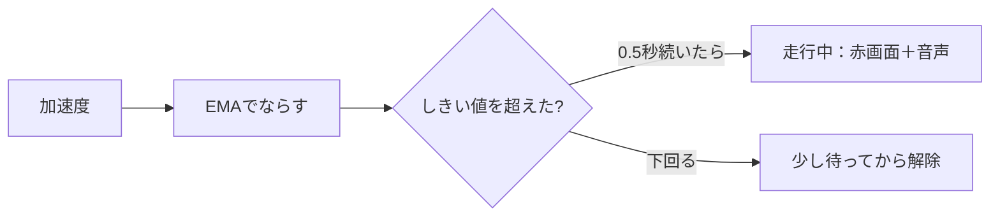

一瞬の揺れで誤って反応しないよう「**続いたら**発火」「**落ち着いてしばらく経ったら**解除」と、わざと鈍くしています。センサーが無い端末では何も起きず、普通に進めます（フォールバック）。

## 5.5 音声

危険の通知は音声でも伝えます。iPhone の Safari は「最初に画面をタップした操作」を起点にしないと音を鳴らせない制約があるため、安全のお約束画面のスタート時に、無音の発話をこっそり1回流して**音声を“解禁”**しておきます。

> 📘 **用語：ストリーム（Stream）**
> 「値が時間とともに次々流れてくる川」のようなしくみ。方角や走行状態は1回きりでなく**流れ続ける**ので、Stream で受け取り、変化があるたびに画面を更新します。

> ✅ **章末チェック**
> 1. 角度の平均に「向きベクトルへの変換」が必要なのはなぜですか。
> 2. 走行検知で「続いたら発火・落ち着いて解除」とわざと鈍くしているのはなぜですか。

---

# 第6章 AI（Gemini）連携とハルシネーション対策【本書の山場】

> 🎯 **学習目標**：生成AIの「ハルシネーション」という弱点を理解し、それを4段階で防ぐ「多層防御」を説明できる。

## 6.1 生成AIとハルシネーション

鳩ナビは Google の生成AI **Gemini** を使って、3つのもの ―「まわる順番」「クイズの文章」「完了画面の保護者向けまとめ（きょうのまなび）」― を作ります。

> 📘 **用語：生成AI / LLM / プロンプト / temperature**
> **LLM（大規模言語モデル）**＝大量の文章を学習し、続きの言葉を予測して文章を作るAI（Geminiもその一つ）。
> **プロンプト**＝AIへの指示文。**temperature**＝出力の「ばらつき」を決める値。高いと creative（自由）、低いと堅実になります。

LLMには**ハルシネーション**という弱点があります。

> 📘 **用語：ハルシネーション（hallucination）**
> AIが、もっともらしいけれど**事実でない内容**を自信ありげに作ってしまう現象。
> 子ども向けの食育クイズで嘘の知識を教えてしまっては大問題です。だから鳩ナビは本気で対策します。

## 6.2 通信経路とAPIキーの秘匿

AIを使うには「APIキー」というパスワードが必要です。これをブラウザに置くと**盗まれて悪用**されます。そこで、ブラウザからは自前の中継サーバ（Vercel Function）だけを呼び、**キーはサーバ側に隠します**。

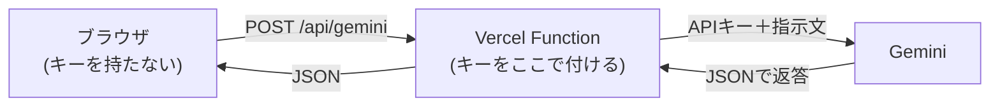

> 📘 **用語：APIキー / 環境変数**
> **APIキー**＝外部サービスを使うための秘密の合言葉。**環境変数**＝プログラムの外側（サーバの設定）に置く値。
> キーをコードに直接書かず環境変数に置くことで、コードを見られても秘密が漏れません。

## 6.3 クイズ生成のシーケンス図

「スキャンしてからクイズが出るまで」を時系列で表すと次のとおりです。

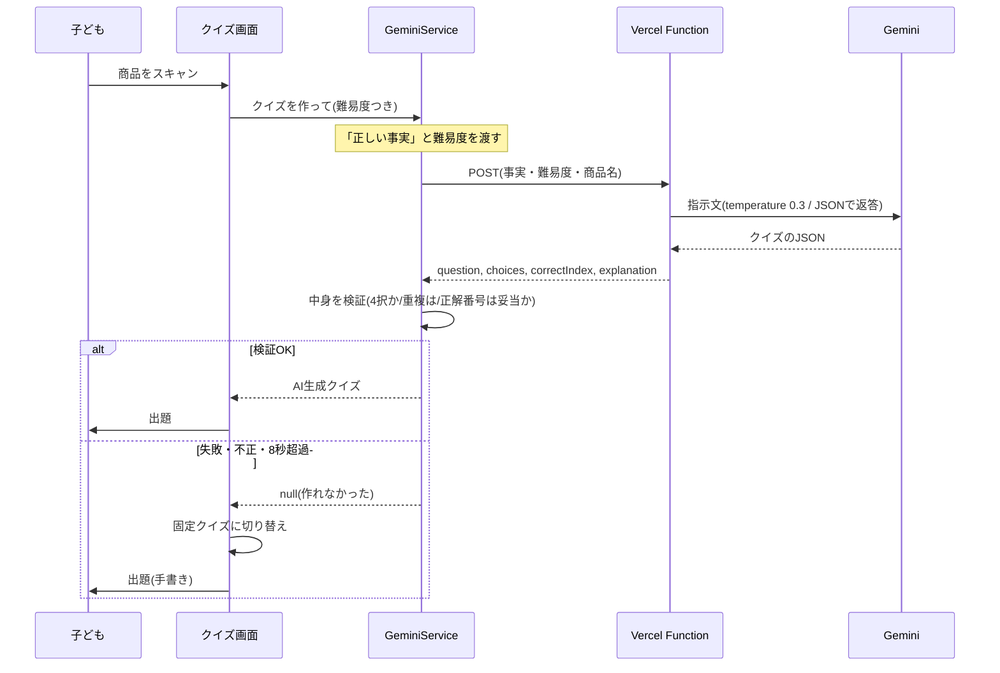

> 📘 **用語：シーケンス図**
> 「誰が・誰に・どんな順で」メッセージをやりとりするかを、上から下への時間軸で描く図（UMLの一種）。処理の流れを追うのに便利です。

## 6.4 ハルシネーション対策＝多層防御（4層）

鳩ナビは1つの工夫に頼らず、**4段階の防御**を重ねます。これを多層防御（多重の安全網）といいます。

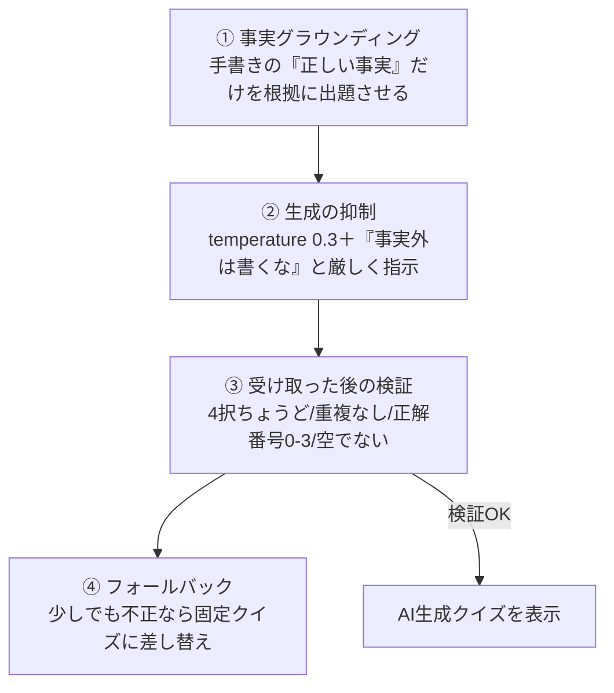

| 層 | 何をする | ねらい |
|---|---|---|
| ① グラウンディング | `explanation`（手書きの事実）を「これだけを根拠にせよ」と渡す | AIに**事実を発明させない** |
| ② 生成抑制 | temperature を低く＋厳格なプロンプト | 創作の暴走・断定を抑える |
| ③ 検証 | 返ってきたJSONの形と内容を機械的にチェック | 壊れた出力を弾く |
| ④ フォールバック | 不正なら固定クイズへ | **間違ったクイズを画面に出さない** |

結果として、利用者には「**検証を通ったAI生成クイズ**」か「**手書きの固定クイズ**」のどちらかしか表示されません。

> 📘 **用語：グラウンディング（grounding）**
> AIの出力を、与えた**信頼できる資料・事実に「接地」させる**こと。「この事実だけを根拠にして」と渡すと、勝手な作り話を減らせます。

## 6.5 巡回順と「回遊性ガード」

「まわる順番」もAIに提案させますが、**鵜呑みにしません**。AIの答えを次の条件で検査し、ダメなら自前の順番（入口→レジの一方向）に戻します。

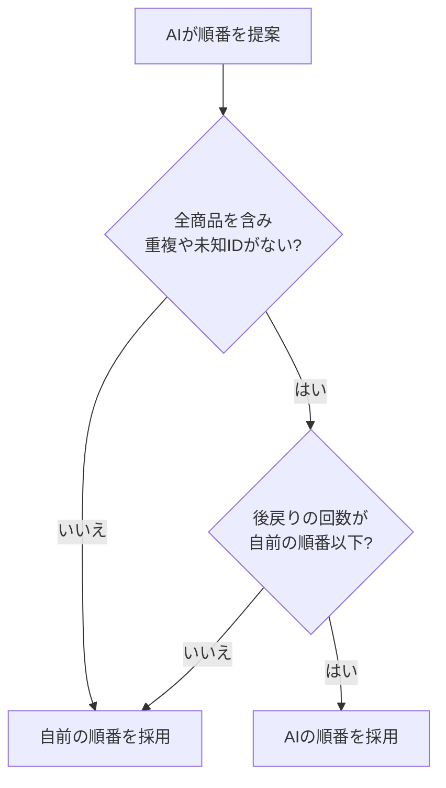

「後戻り（来た方向へ戻る）」が増えると歩く距離が無駄に増えるため、AI案が自前案より**遠回りにならないときだけ**採用します。これを回遊性ガードと呼びます。

## 6.6 保護者サマリ（きょうのまなび）も同じしくみで守る

完了画面でAIが作る「おうちのひとへ：きょうのまなび」も、クイズと**まったく同じ考え方**で守ります。

- **根拠を限定**：子どもが今日学んだ商品の「正しい事実（`explanation`）」だけを渡し、それ以外は書かせない（グラウンディング）。
- **ばらつきを抑える**：temperature は 0.4。順番（0.7）より低く、クイズ（0.3）より少しだけ自由にして、温かい文章にする。
- **失敗しても空にしない**：AIが落ちたり空を返したら、あらかじめ用意した**固定のまとめ文**に切り替え、保護者カードを必ず埋める（フォールバック）。

つまり「AIが書くけれど、事実から外れない・失敗しても止まらない」という鳩ナビの原則が、3つ目のAI機能にも一貫して適用されています。

> ✅ **章末チェック**
> 1. ハルシネーションとは何か、なぜ鳩ナビで特に問題なのか説明しましょう。
> 2. 多層防御の4つの層をそれぞれ一言で説明しましょう。
> 3. APIキーをブラウザに置かないのはなぜですか。
> 4. 保護者サマリが「事実から外れない」のはなぜですか。2つのしくみを挙げましょう。

---

# 第7章 インフラとデプロイ ― どうやって世界に公開するか

> 🎯 **学習目標**：作ったアプリが「git push するだけで自動公開される」しくみ（CI/CD）を理解する。

## 7.1 Vercel構成

鳩ナビは **Vercel** というサービス1つで、画面（静的ファイル）とAI中継（Function）の両方を公開しています。

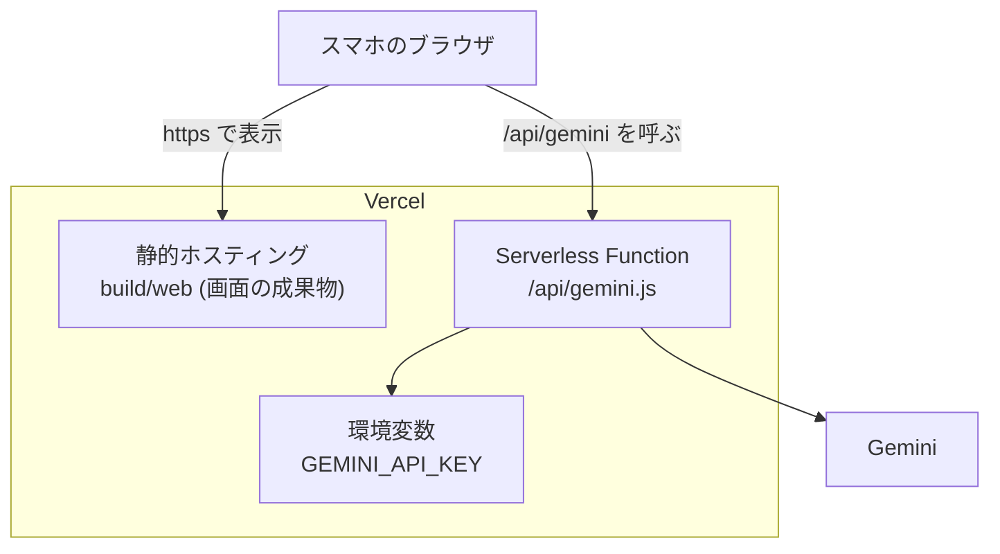

同じ住所（オリジン）から画面とAPIを配るので、面倒な許可設定（CORS）やキー漏れの心配が減ります。また **HTTPS**（暗号化通信）で配るため、カメラや方角センサーを使えます（これらは安全な通信でないと使えません）。

## 7.2 vercel.json の意味

公開の設定は `vercel.json` に書かれています。要点は3つです。

| 設定 | 意味（やさしく言うと） |
|---|---|
| `buildCommand` | Vercel上に Flutter を取ってきて「Web用に書き出す」命令 |
| `outputDirectory` | 書き出した成果物（`build/web`）を公開する指定 |
| `rewrites` | `/api/` 以外のアクセスは全部トップページに渡す（ページ内移動のため） |

ポイントは、**完成品（build/web）をGitに入れていない**こと。コードだけ置いておき、公開のたびにVercelが**自動でビルド**します。

## 7.3 デプロイパイプライン（CI/CD）

開発者がコードを送る（push する）と、あとは自動で公開まで進みます。

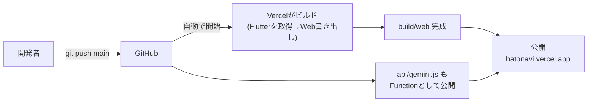

> 📘 **用語：CI/CD**
> **CI（継続的インテグレーション）**＝コードを送るたびに自動でビルド・検査するしくみ。
> **CD（継続的デリバリ/デプロイ）**＝そのまま自動で公開まで進めるしくみ。
> 人手の作業ミスを減らし、すぐに反映できます。

## 7.4 セキュリティ・プライバシー

- APIキーはブラウザに出さず、サーバの環境変数で隠す。
- 子どもの**位置情報・カメラ映像はサーバへ送らない**（端末内で完結。GPS等の測位も使わない）。
- 店内マップ画像は実行時に使わず、開発時に座標データへ変換済み（AIにも渡さない）。

> ✅ **章末チェック**
> 1. CI/CD があると何が嬉しいですか。
> 2. 完成品（build/web）をGitに入れず、毎回ビルドするのはなぜでしょう。

---

# 第8章 まとめ ― この開発から学べる設計の原則

鳩ナビは小さなアプリですが、実務で重要な設計原則が詰まっています。最後に、応用のきく**4つの教訓**として整理します。

1. **関心の分離**：画面・ロジック・データ・外部を層で分け、直す場所を局所化する。
2. **フォールバック設計（止まらない作り）**：AI・ネット・センサー・OSが失敗しても、固定データ／北固定／無音などへ自動で切り替え、体験を止めない。
3. **AIは「得意なことだけ」任せ、結果を検証する**：間違うと危険なこと（方角・安全・進行・お金）は自前で確実に。AIには検証・やり直しがきく仕事（文章・順番案）だけを任せ、グラウンディング→生成抑制→検証→フォールバックの多層防御で守る。
4. **秘密はサーバへ、自動化はCI/CDへ**：APIキーは環境変数で隠し、公開は push で自動化する。

> 🎯 **総合演習**
> あなたが鳩ナビに新しい機能（例：子どもの正誤の履歴から、次回のクイズ難易度を自動で調整する）を足すとします。
> (1) どの層に何を追加しますか。 (2) AIに作らせる部分があるなら、ハルシネーションをどう防ぎますか。 (3) どうやって公開しますか。
> 本書の4原則に沿って設計を説明してみましょう。（ヒント：完了画面の「保護者サマリ」はすでに第6章の方法で実装済みです。）

---

### 付録：用語ミニ辞典（五十音）

- **イミュータブル**：作った後に中身を変えないオブジェクト。バグを防ぐ。
- **APIキー**：外部サービスを使う秘密の合言葉。漏らさないよう環境変数に置く。
- **EMA（指数移動平均）**：直近を重く見て平均し、値をなめらかにする計算。
- **温度（temperature）**：AI出力のばらつき具合。低いと堅実、高いと自由。
- **関心の分離**：1部品1役割にして、読みやすく直しやすくする設計。
- **グラウンディング**：AIの出力を信頼できる事実に接地させること。
- **サーバレス（Serverless Function）**：必要なときだけ動く小さなサーバ処理。
- **状態管理 / setState**：画面の状態を覚え、変化したら描き直すしくみ。
- **ストリーム（Stream）**：値が次々流れてくるしくみ。センサー値などに使う。
- **宣言的UI**：結果を宣言すれば描画は任せる、という画面の作り方。
- **デプロイ**：作ったソフトを公開・配置すること。
- **ハルシネーション**：AIがもっともらしい嘘を作る現象。
- **フォールバック**：本命が失敗したときの予備の処理。
- **プロンプト**：AIへの指示文。
- **CI/CD**：コード送信をきっかけに自動でビルド〜公開まで行うしくみ。

*（本書は鳩ナビ おつかいクエストの実装をもとに、学習用にやさしく再構成したものです。）*
