# 鳩ナビ おつかいクエスト ― 機能別 解説書（フローチャート＆アーキテクチャ図）

> このアプリの機能を**1つずつ**、**フローチャート（処理の流れ）**と**アーキテクチャ図（関わる部品）**の2枚で説明する。
> すべて実装コードに基づく。図は Mermaid 記法。

---

## 図の凡例

- **フローチャート**：ユーザー操作 → 内部処理 → 結果（分岐・フォールバックを含む）の時間的な流れ。
- **アーキテクチャ図**：その機能に関わる **画面層 / サービス層 / データ層 / 外部（Gemini・ブラウザWeb API）** の依存関係。
- 色や枠は意味を持たせていない（描画ツール差を避けるため）。

## 機能一覧

| # | 機能 | 主な画面 | 主なサービス | AI |
|---|---|---|---|---|
| 1 | 難易度選択 | Home | LevelService | — |
| 2 | 買い物リスト＋巡回順 | ShoppingList | GeminiService | ○(order) |
| 3 | 安全のお約束＋音声解放 | SafetyPledge | SpeechService | — |
| 4 | 巡回ナビ（方角・距離・較正） | Navigation/Compass | CompassService | — |
| 5 | 走行検知・ロック・危険アラート | Compass/Navigation | MotionService/SpeechService | — |
| 6 | スキャン＋クイズ＋途中追加 | Quiz/Navigation | GeminiService/LevelService | ○(quiz) |
| 7 | ポイント・スタンプ・シール交換 | Sticker/Point | PointService | — |
| 8 | 完了画面＋保護者サマリ＋図鑑 | Sticker | GeminiService/PointService | ○(summary) |
| 9 | インフラ・デプロイ | —（横断） | — | — |

---

# 0. 全体アーキテクチャ（土台）

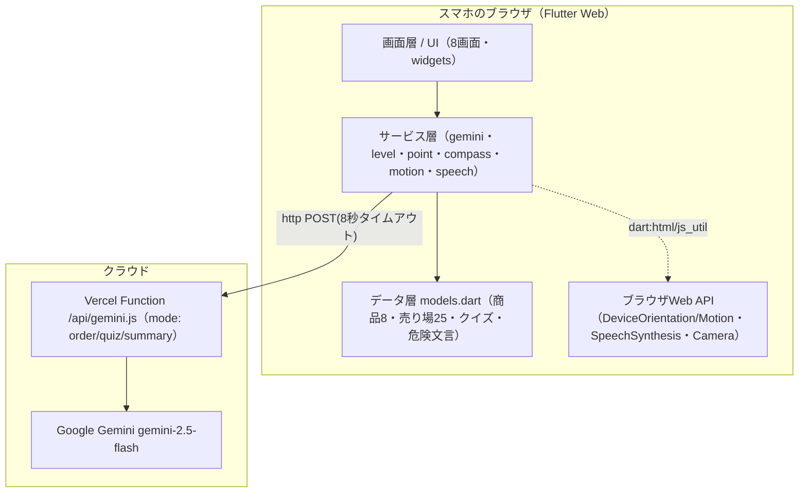

- 画面はサービスを呼ぶだけ。AIは必ず Vercel Function を経由（`GEMINI_API_KEY` をフロントに出さない）。
- センサー・音声・カメラは端末内で完結（位置情報・映像をサーバに送らない）。
- AIは1つのFunctionに3モードを集約。**temperatureはモード別**（order=0.7／quiz=0.3／summary=0.4）、**タイムアウトは全モード共通8秒**。Functionは CORS/プリフライト(OPTIONS)も吸収し、**200以外は一律 null → ローカル(固定データ)へフォールバック**。
- `models.dart` の内訳：**商品8品＋途中追加用ボーナス1・売り場25区画・危険文言2**（危険文言は現状[0]のみ使用）。

---

# 1. 難易度選択（クイズのむずかしさ）

**概要**：ホームで「未就学／小学生／高学年」を選ぶ。選択は端末に保存され、クイズ生成時の言葉づかいに反映。

### フローチャート
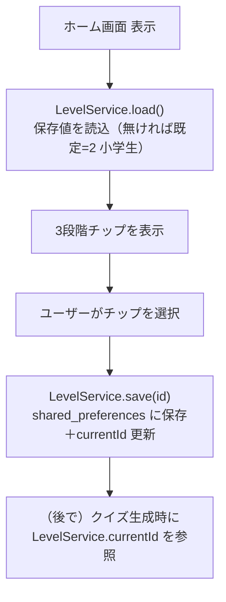

### アーキテクチャ図
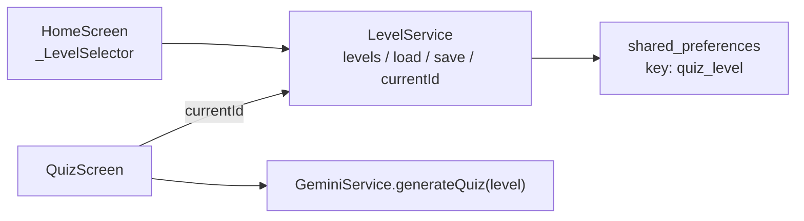

**根拠**：`home_screen.dart`（`_selectLevel`→`LevelService.save`）／`level_service.dart`（`levels` 3段階・`defaultId=2`・同期キャッシュ `currentId`）／`quiz_screen.dart`（`level: LevelService.currentId`）。

> 補足：`currentId` を**同期キャッシュ**にしているのは、クイズ生成が `await` できない描画タイミングで level を即値で必要とするため。レベルごとの指示文 `hint` が `levelHint` として Gemini に渡り言葉づかいに反映される。不正な id は既定(2)へ丸める。

---

# 2. 買い物リスト選択 ＋ 巡回順の生成

**概要**：8品から選び、「買う順番」を決める。ローカルが売り場の並び順で必ず確定し、AIの並べ替え案は検証＋回遊性ガードを通った場合のみ採用。

### フローチャート
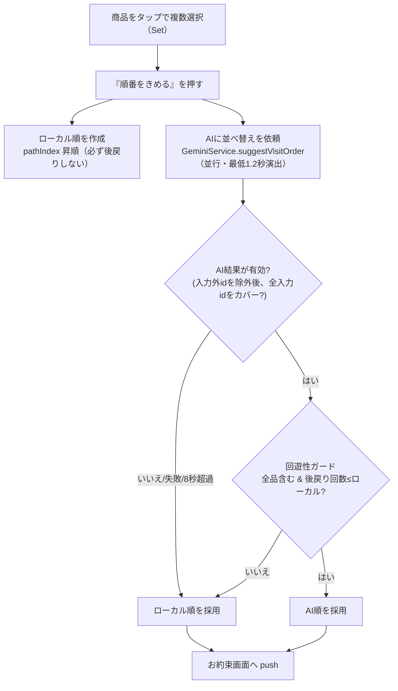

### アーキテクチャ図
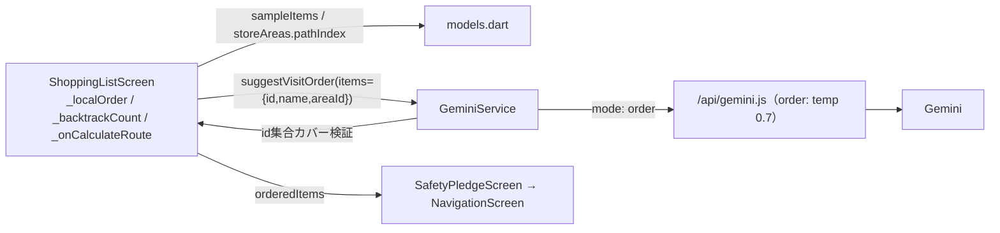

**根拠**：`shopping_list_screen.dart`（`_localOrder` pathIndex昇順・`_backtrackCount`・採用条件 `aiOrder.length==全件 && backtrack(ai)<=backtrack(local)`）／`gemini_service.dart`（`suggestVisitOrder`：**入力外idを除外し、残りが入力id集合を全てカバーするときだけ採用**。欠落があれば null）／`api/gemini.js`（mode order・temp0.7）。

> 補足：ソートのキーは商品の `id` ではなく **`areaId`→`pathIndex`**（`sampleItems` は `id:'vegetables'` でも `areaId:'local_vegetables'` のように両者が異なる品がある）。回遊性が「同点」でもAI順を採るのは、pathIndex以外の良さ（実距離など）をAIが出しうるため。ただし後戻りが増える案は必ずローカルを守る。

---

# 3. 安全のお約束 ＋ 音声解放

**概要**：ナビ開始前に「はしらない／まえをみる／おとなのそばにいる」を確認。スタート時に iOS の音声を“解放”しておく。

### フローチャート
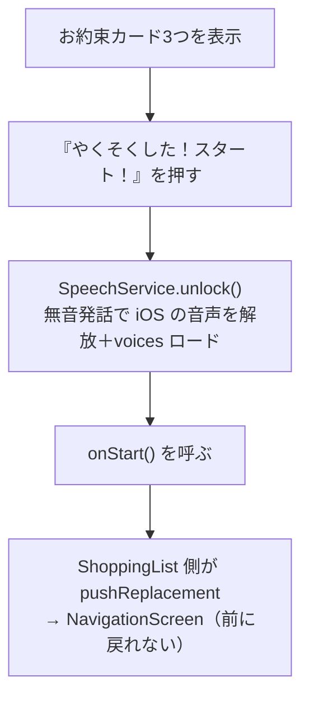

### アーキテクチャ図
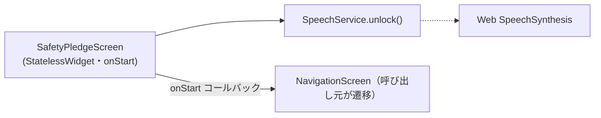

**根拠**：`safety_pledge_screen.dart`（`_StartButton` で `SpeechService.unlock()`→`onStart()`、自身は遷移を持たない）／`speech_service.dart`（`unlock`）／`shopping_list_screen.dart`（`onStart` 内で `pushReplacement`）。

> 補足：iOS Safari は `speechSynthesis.speak()` を**ユーザー操作（タップ）起点でしか鳴らせない**。だから後の危険検知（プログラム起点）でも鳴るよう、最初のタップ＝スタートで無音発話を流し音声を“解放”する。`unlock`/`speak` は例外を握りつぶす（非対応ブラウザでも落ちない）。

---

# 4. 巡回ナビ（方角・距離の目安・コンパス・較正）

**概要**：次の1売り場だけを提示。方角と距離の目安は**ローカルが座標から計算**。コンパスはセンサー方位で針を回し、ワンタップ較正でマップ北を合わせる。

### フローチャート
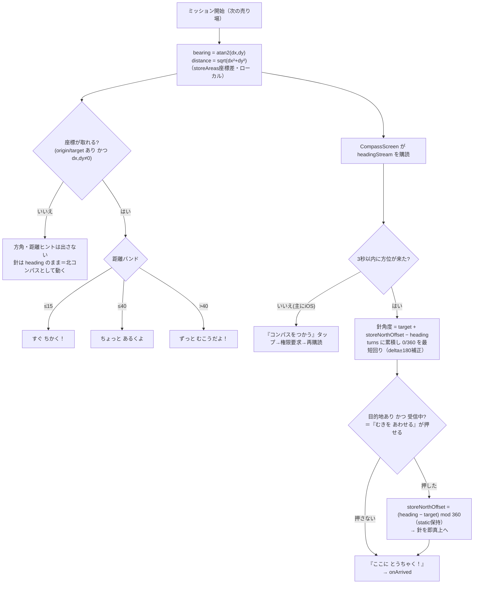

### アーキテクチャ図
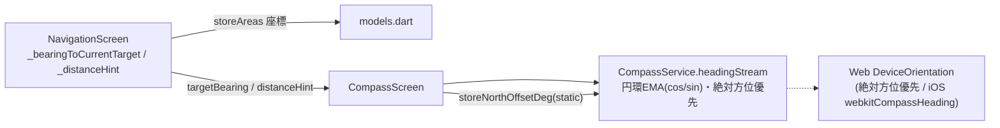

**根拠**：`navigation_screen.dart`（`atan2(dx,dy)`・距離 `sqrt`・バンド `≤15/≤40/>40`・同座標は null）／`compass_screen.dart`（針角度 `target+offset-heading`・較正 `offset=heading-target`・`turns` 累積で最短回り）／`compass_service.dart`（円環スムージング EMA0.2・最小1.0度・絶対方位優先で相対は捨てる）。

> 補足：較正値 `storeNorthOffsetDeg` は **static** なので、1回合わせれば**全ミッションで北のズレを共有**（毎回合わせ直さなくてよい）。絶対方位を一度でも受けたら相対方位イベントは捨て、**2方式を混ぜない**ことで象限ごとのズレを防いでいる。

---

# 5. 走行検知・走行ロック・危険アラート（安全）

**概要**：加速度で「走り」を検知して赤い全画面ロック＋音声。危険箇所では2ミッション目に一度だけ警告。判定はすべてローカル（AI不使用）。

### フローチャート
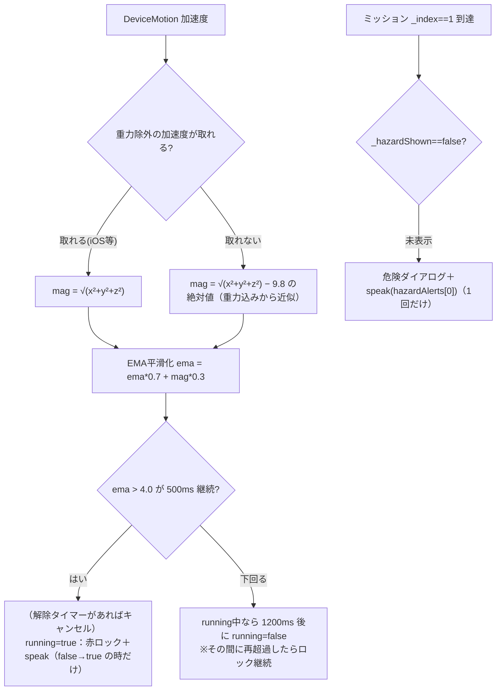

### アーキテクチャ図
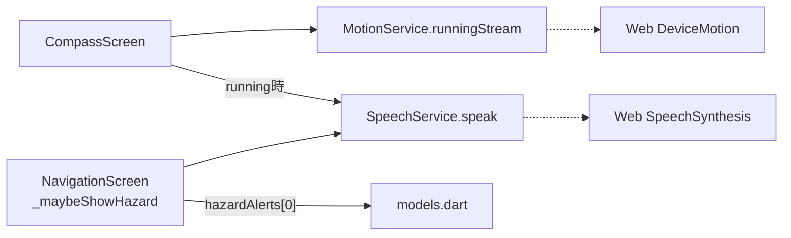

**根拠**：`motion_service.dart`（しきい値 `4.0`・継続 `500ms`・EMA `0.7/0.3`・解除 `1200ms`・状態変化時のみ・非対応は無流し）／`compass_screen.dart`（`_RunLockOverlay`＋speak・直前を `cancel()` してから発話）／`navigation_screen.dart`（`_hazardShown` で1回・`hazardAlerts[0]`）。

> 補足：`hazardAlerts` は2件あるが**現状は [0]（総菜コーナーのすべりやすさ）のみ使用**（2件目は未使用データ）。しきい値4.0は「歩行 ~1〜3／早歩き ~3〜5／走り ~6〜15」のうち、ゆっくり歩行は許し速いと警告する狙い。**iOSで音声が鳴るのは §3 の `unlock()`（タップ起点）が前提**。

---

# 6. 商品スキャン ＋ AIクイズ生成 ＋ 途中追加

**概要**：バーコードを読み（演出）、AIが事実に基づくクイズを生成。検証を通ればAI、ダメなら手書き固定クイズ。リスト外商品は🛒から汎用クイズ。

### フローチャート
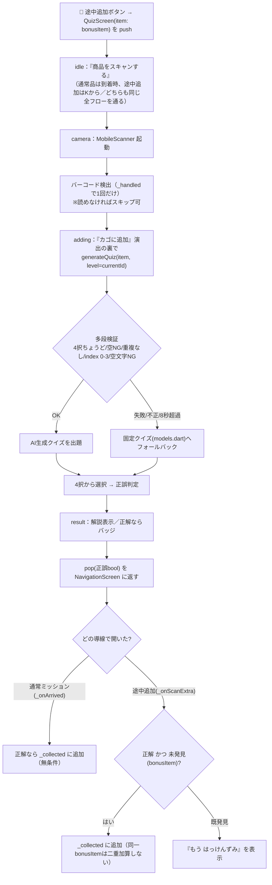

### アーキテクチャ図
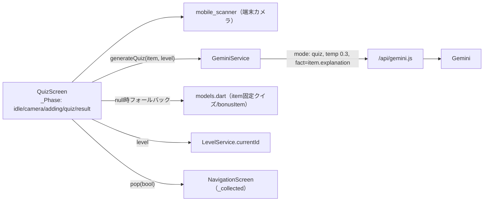

**根拠**：`quiz_screen.dart`（`_Phase`・`_handled`・`generateQuiz(level:currentId)`・`_quiz?.x ?? widget.item.x`・`pop(_isCorrect)`）／`gemini_service.dart`（`generateQuiz` の検証）／`api/gemini.js`（mode quiz・temp0.3）／`navigation_screen.dart`（`_onScanExtra` の重複ガード）。

---

# 7. ポイント・スタンプ・シール交換

**概要**：クイズ正解数がポイント。2ポイントで1スタンプ、5スタンプ（10ポイント）でシール引換券と交換。累計は端末に保存。

### フローチャート
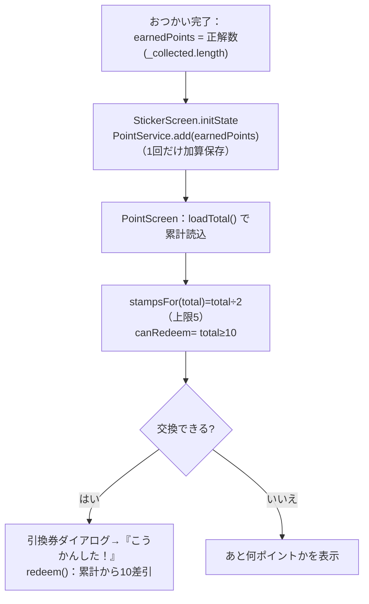

### アーキテクチャ図
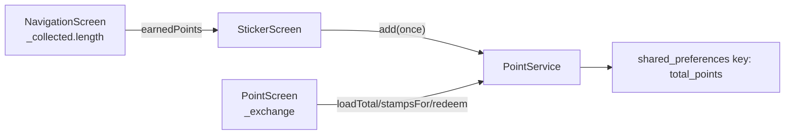

**根拠**：`navigation_screen.dart`（`earnedPoints: _collected.length`）／`sticker_screen.dart`（`initState` で `PointService.add` を1回）／`point_service.dart`（`pointsPerStamp=2`・`stampsToRedeem=5`・`stickerThreshold=10`・`stampsFor`/`canRedeem`/`redeem`）／`point_screen.dart`（`_exchange`・`toNextStamp`）。

> 補足：ポイント加算は **StickerScreen の initState で1回だけ**。PointScreen は表示と交換(`redeem`=10差引)のみで加算しない（二重加算防止）。スタンプは10超でも5で頭打ち、表示は「次のスタンプまで」と「シール交換まで」の2種類。

---

# 8. 完了画面 ＋ 保護者サマリ（AI）＋ 図鑑

**概要**：お会計演出 → シール引換券 → ご当地はとっぴー図鑑 → AIが保護者向けに「きょうのまなび」をまとめる（失敗時は固定文）。

### フローチャート
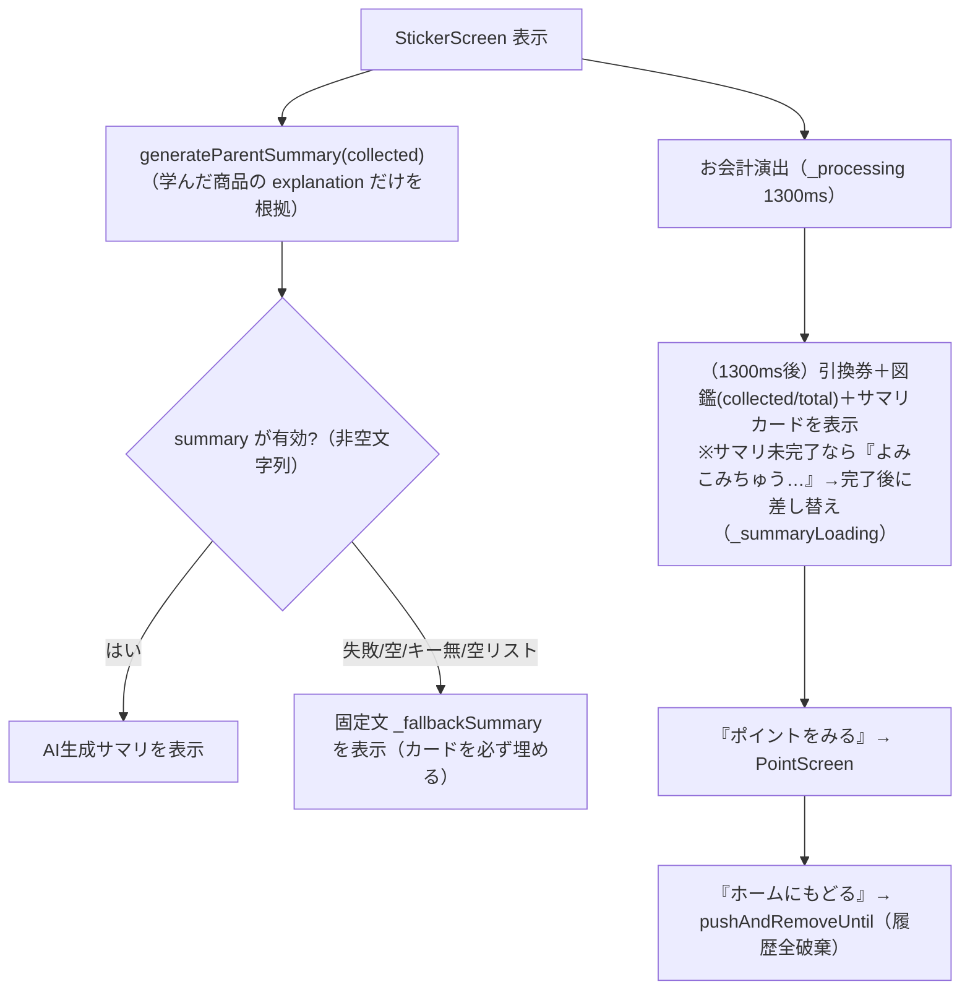

### アーキテクチャ図
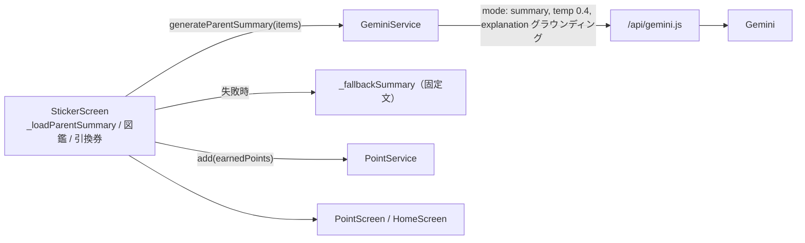

**根拠**：`sticker_screen.dart`（`_loadParentSummary`・`_fallbackSummary`・図鑑 `collected/total`・`_PayingView` 1300ms）／`gemini_service.dart`（`generateParentSummary`：空文字列なら null）／`api/gemini.js`（mode summary・temp0.4）。

---

# 9. インフラ・デプロイ（横断）

**概要**：`main` に push すると Vercel が Flutter をビルドして公開。AIキーは環境変数で秘匿。実質これがCI/CD。

### フローチャート
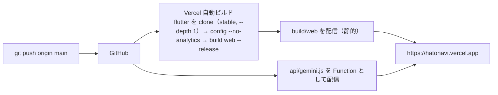

### アーキテクチャ図
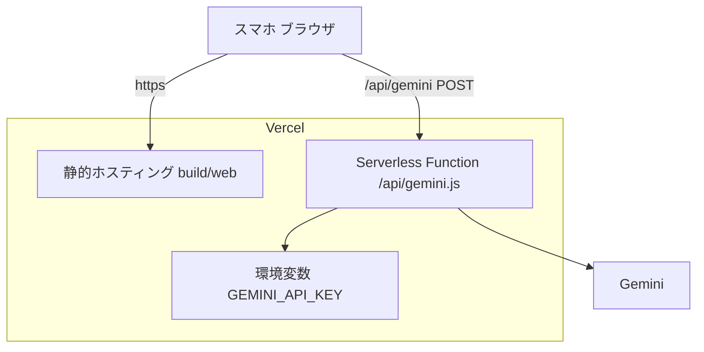

**根拠**：`vercel.json`（`buildCommand` で flutter clone＋build web・`outputDirectory: build/web`・rewrites `/api/` 除外）／`.gitignore`（`/build/` 管理外）／`api/gemini.js`（`process.env.GEMINI_API_KEY`・CORS/OPTIONS吸収）。

> 補足：Function のエラーは段階的（**405** POST以外／**500** キー無／**400** 未知mode／**502** Gemini側失敗・no_text・parse_error）。フロントは `statusCode != 200` で一律 null を返し、**どのエラーでもローカル固定データに落ちる**（「失敗しても止まらない」の最終防壁）。

---

## まとめ

- 全機能は **画面層 → サービス層 → データ層/外部** の単方向で構成。
- **AIは3用途（order/quiz/summary）**のみで、いずれも**グラウンディング＋検証＋フォールバック**。方角・距離・安全・進行・会計・スキャンはローカル。
- どの機能も「**失敗しても止まらない**」フォールバックを持つ（固定クイズ／ローカル巡回順／固定サマリ／北固定／無音）。
